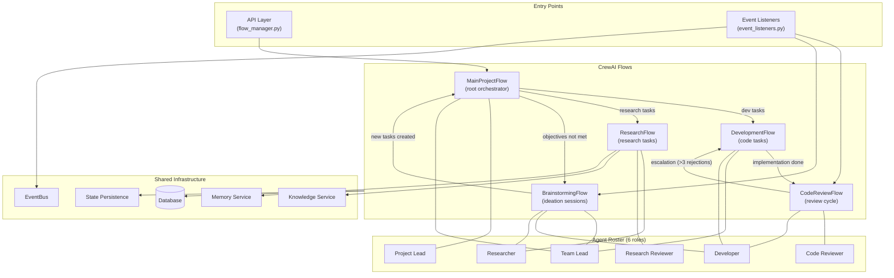
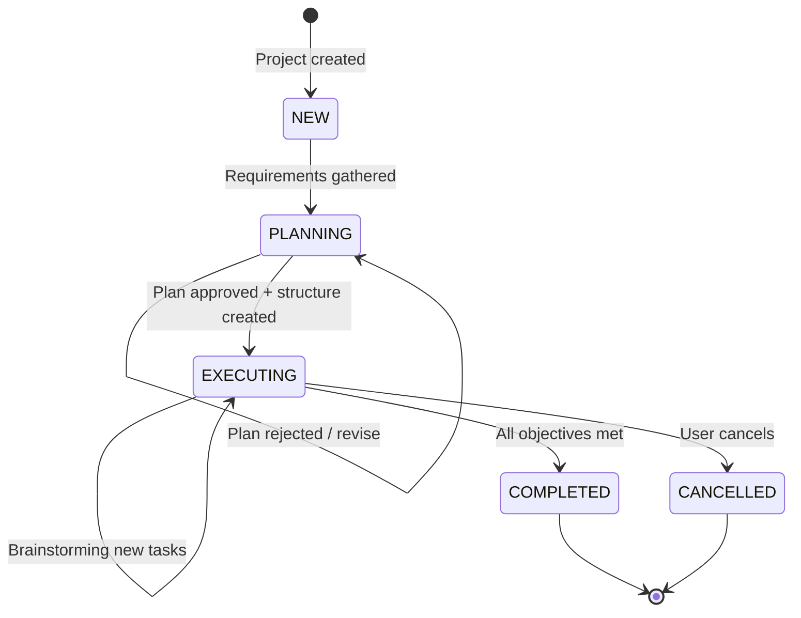

# System Overview - CrewAI Flow Architecture

## Flow Orchestration

## Project Lifecycle (High Level)

## Agent Roles Summary

| Agent | Primary Flow(s) | Responsibilities |
|-------|-----------------|-----------------|
| **Project Lead** | MainProjectFlow, BrainstormingFlow | User communication, requirements gathering, plan approval, final report |
| **Team Lead** | MainProjectFlow, DevelopmentFlow, BrainstormingFlow | Planning, task structure (epics/milestones/tasks), assignments, escalations, idea consolidation |
| **Developer** | DevelopmentFlow, CodeReviewFlow, BrainstormingFlow | Code implementation, rework on rejection, idea proposals |
| **Code Reviewer** | CodeReviewFlow | Code quality review, approve/reject decisions |
| **Researcher** | ResearchFlow, BrainstormingFlow | Literature review, hypothesis, investigation, report writing, idea proposals |
| **Research Reviewer** | ResearchFlow | Peer review of research findings, validation |
