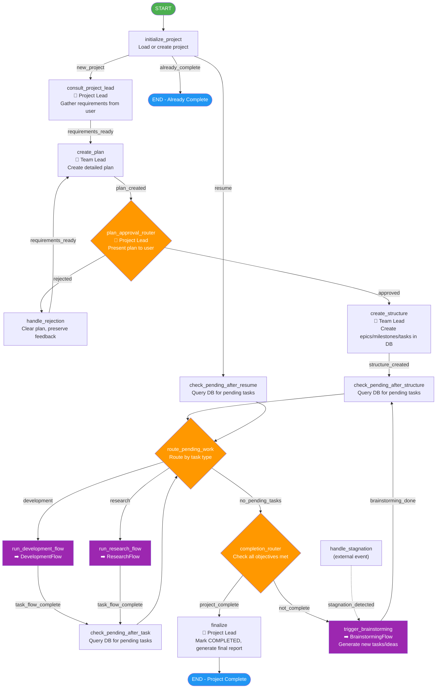

# MainProjectFlow

**File:** `backend/flows/main_project_flow.py`
**State Model:** `ProjectState`
**Purpose:** Root orchestrator for the complete project lifecycle. Manages requirements gathering, planning, task execution, and completion detection.

## State Model

| Field | Type | Description |
|-------|------|-------------|
| `project_id` | str | Unique project identifier |
| `project_name` | str | Human-readable project name |
| `status` | str | `NEW` / `PLANNING` / `EXECUTING` / `COMPLETED` / `CANCELLED` |
| `requirements` | str | Gathered requirements from user |
| `plan` | str | Detailed project plan |
| `user_approved` | bool | Whether user approved the plan |
| `current_task_id` | str | Currently executing task ID |
| `current_task_type` | str | Type of current task (development/research) |
| `epics_created` | int | Count of created epics |
| `milestones_created` | int | Count of created milestones |
| `tasks_created` | int | Count of created tasks |
| `completed_tasks` | int | Count of completed tasks |

## Flow Diagram

## Key Decision Points

1. **Plan Approval Router** - User must approve the plan before execution begins. Rejection loops back with feedback.
2. **Route Pending Work** - Dispatches tasks by type: `development` or `research`. When no tasks remain, checks completion.
3. **Completion Router** - Determines if all project objectives are met. If not, triggers brainstorming for new ideas/tasks.

## Sub-Flow Invocations

| Sub-Flow | Trigger | Returns To |
|----------|---------|------------|
| `DevelopmentFlow` | Task type = development/bug_fix/test/integration/design | `check_pending_after_task` |
| `ResearchFlow` | Task type = research | `check_pending_after_task` |
| `BrainstormingFlow` | Objectives not met after all tasks done | `check_pending_after_structure` |
