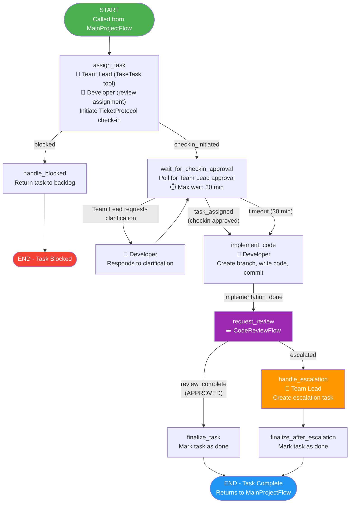
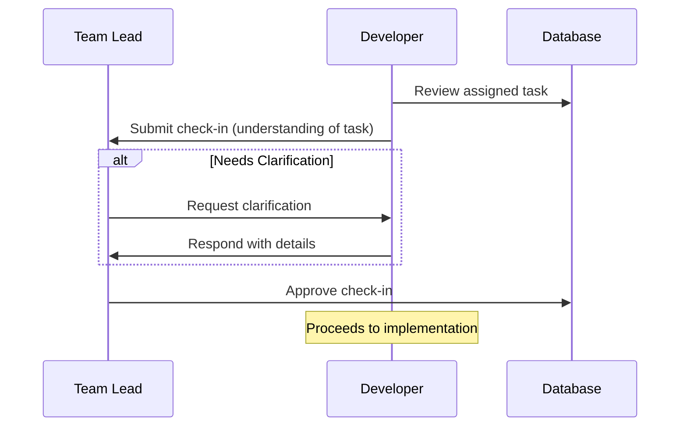

# DevelopmentFlow

**File:** `backend/flows/development_flow.py`
**State Model:** `DevelopmentState`
**Purpose:** Manages the development lifecycle for a single code task, including assignment, check-in protocol, implementation, and code review.

## State Model

| Field | Type | Description |
|-------|------|-------------|
| `project_id` | str | Parent project ID |
| `task_id` | str | Task being worked on |
| `task_title` | str | Human-readable task title |
| `task_description` | str | Detailed task description |
| `branch_name` | str | Git branch for the implementation |
| `developer_id` | str | Assigned developer agent ID |
| `review_status` | str | Review outcome (`APPROVED` / `ESCALATED`) |
| `escalated` | bool | Whether the task was escalated |
| `dependencies_met` | bool | Whether task dependencies are satisfied |
| `checkin_thread_id` | str | Thread ID for TicketProtocol check-in |
| `checkin_approved` | bool | Whether Team Lead approved the check-in |

## Flow Diagram

## TicketProtocol Check-in Sequence

## Key Decision Points

1. **Dependency Check** - If task dependencies are not met, the task is returned to the backlog (blocked).
2. **Check-in Gate** - Developer must demonstrate understanding of the task before implementation begins. Team Lead can request clarification.
3. **Review Outcome** - After CodeReviewFlow, either the task is approved or escalated (after 3+ rejections).

## Agent Responsibilities

| Agent | Actions |
|-------|---------|
| **Team Lead** | Takes task (TakeTask tool), approves check-in, handles escalations |
| **Developer** | Reviews assignment, submits check-in, creates branch, implements code, commits |
