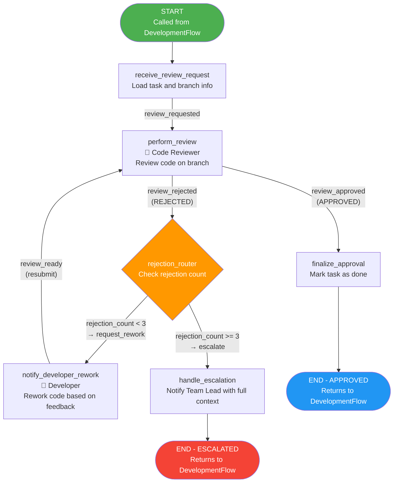
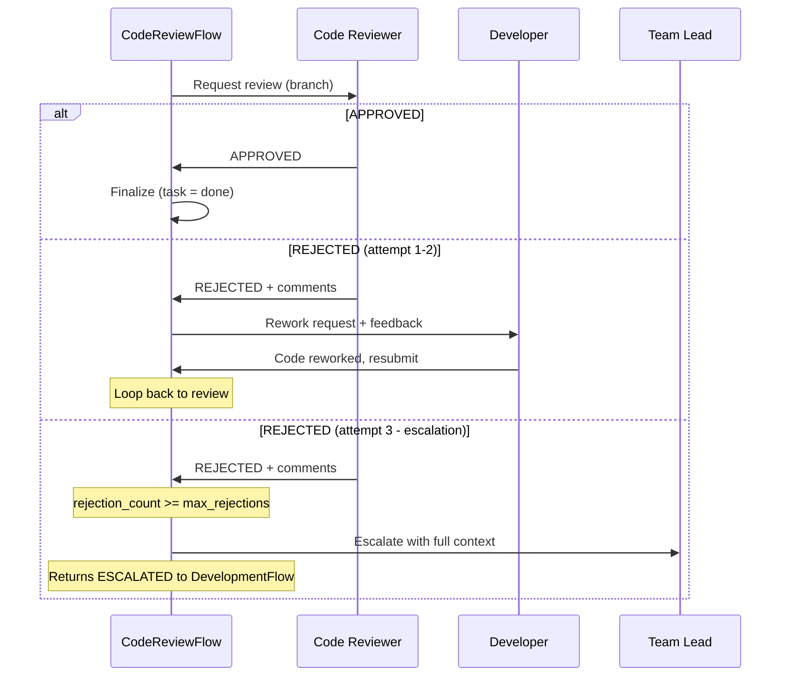
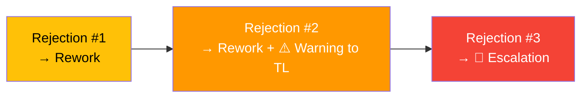

# CodeReviewFlow

**File:** `backend/flows/code_review_flow.py`
**State Model:** `CodeReviewState`
**Purpose:** Manages the code review cycle with iterative feedback, rework, and escalation after repeated rejections.

## State Model

| Field | Type | Description |
|-------|------|-------------|
| `project_id` | str | Parent project ID |
| `task_id` | str | Task being reviewed |
| `branch_name` | str | Git branch under review |
| `review_status` | str | Current review status |
| `reviewer_id` | str | Assigned Code Reviewer agent ID |
| `developer_id` | str | Developer who wrote the code |
| `agent_run_id` | str | Current agent run ID |
| `reviewer_comments` | list | Accumulated review comments |
| `rejection_count` | int | Number of times review was rejected |
| `max_rejections` | int | Maximum rejections before escalation (default: 3) |

## Flow Diagram

## Review Cycle Detail

## Escalation Warning

At `rejection_count == 2`, the flow notifies the Team Lead with an escalation warning, giving visibility before the final attempt.

## Key Decision Points

1. **Review Outcome** - Code Reviewer decides APPROVED or REJECTED based on code quality.
2. **Rejection Router** - Counts rejections. Under threshold: rework loop. At/over threshold: escalation.

## Agent Responsibilities

| Agent | Actions |
|-------|---------|
| **Code Reviewer** | Reviews code on branch, provides comments, decides APPROVED/REJECTED |
| **Developer** | Reworks code based on reviewer feedback, resubmits for review |
| **Team Lead** | Receives escalation notification with full review history (notified, not an active participant) |
