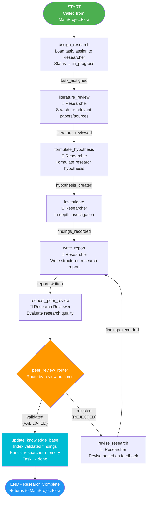
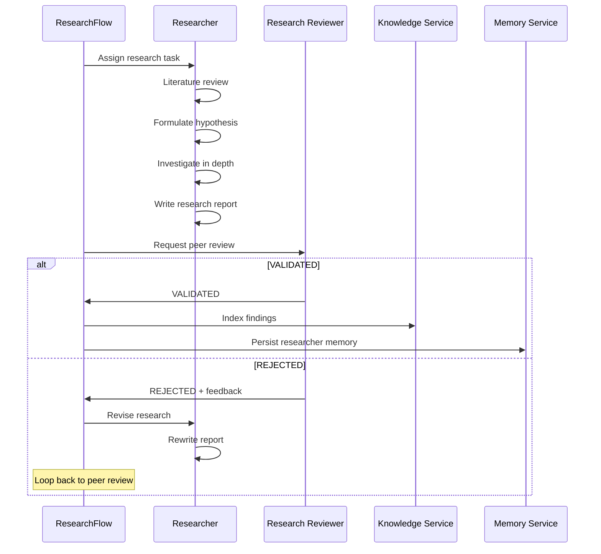
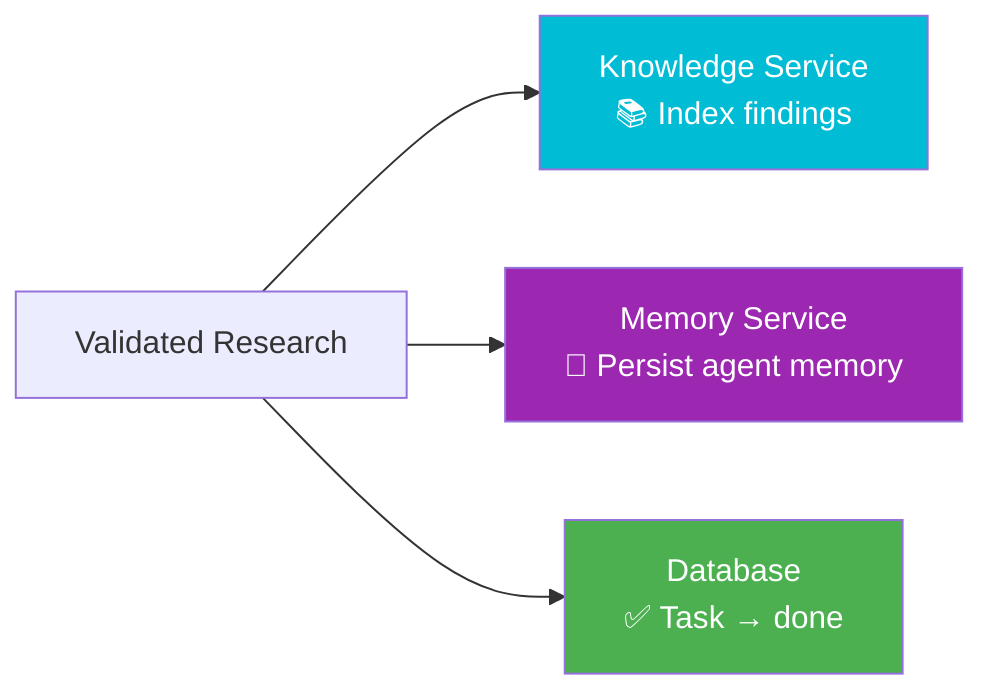

# ResearchFlow

**File:** `backend/flows/research_flow.py`
**State Model:** `ResearchState`
**Purpose:** Manages research task lifecycle including literature review, hypothesis formulation, investigation, report writing, peer review, and knowledge base integration.

## State Model

| Field | Type | Description |
|-------|------|-------------|
| `project_id` | str | Parent project ID |
| `task_id` | str | Research task being worked on |
| `task_title` | str | Human-readable task title |
| `researcher_id` | str | Assigned Researcher agent ID |
| `hypothesis` | str | Formulated research hypothesis |
| `findings` | list | Accumulated research findings |
| `confidence_scores` | list | Confidence scores for findings |
| `peer_review_status` | str | `VALIDATED` or `REJECTED` |
| `validated` | bool | Whether research passed peer review |
| `report_path` | str | Path to the written research report |
| `references` | list | Collected references |
| `knowledge_service_enabled` | bool | Whether knowledge indexing is active |

## Flow Diagram

## Research Pipeline Detail

## Knowledge Integration

When research is validated, the flow:

1. **Indexes findings** in the Knowledge Service for future reference by other agents
2. **Persists researcher memory** via the Memory Service, allowing the agent to learn from past research
3. **Marks task as done** in the database

## Key Decision Points

1. **Peer Review Outcome** - Research Reviewer validates or rejects findings. Rejection triggers a revision loop.

## Agent Responsibilities

| Agent | Actions |
|-------|---------|
| **Researcher** | Literature review, hypothesis formulation, investigation, report writing, revisions |
| **Research Reviewer** | Peer review, validation/rejection with feedback |
