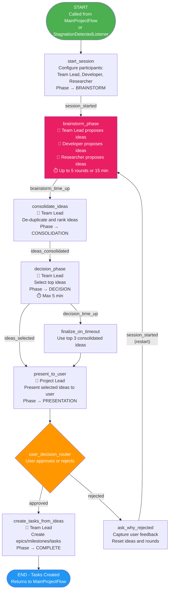
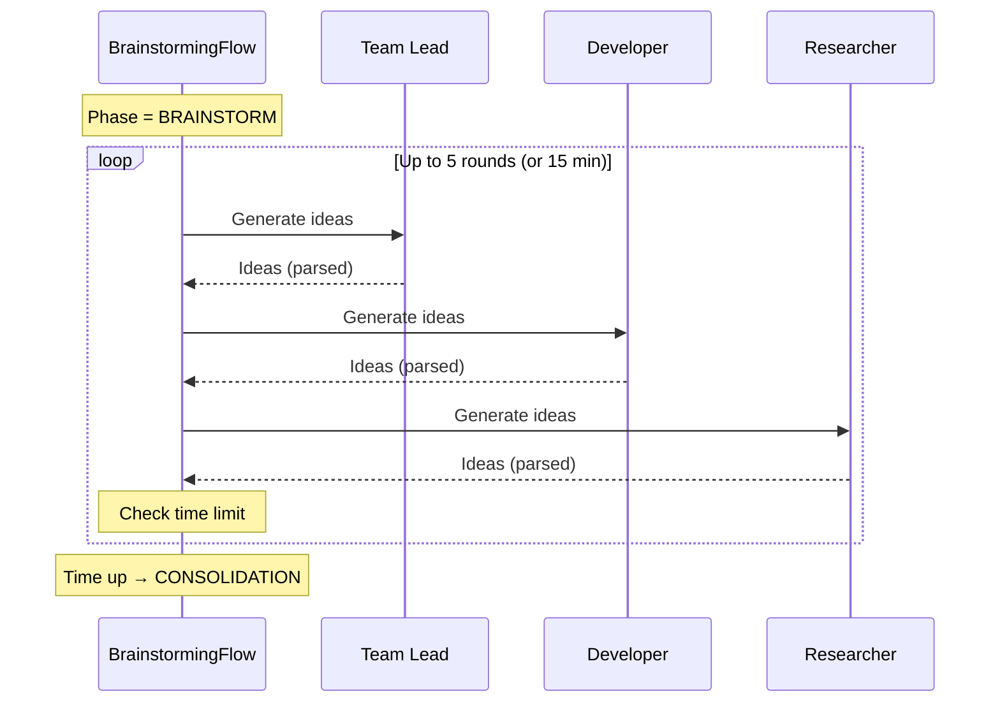
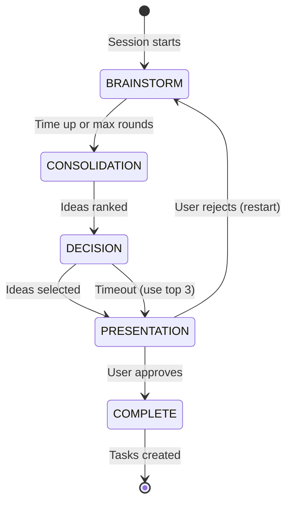
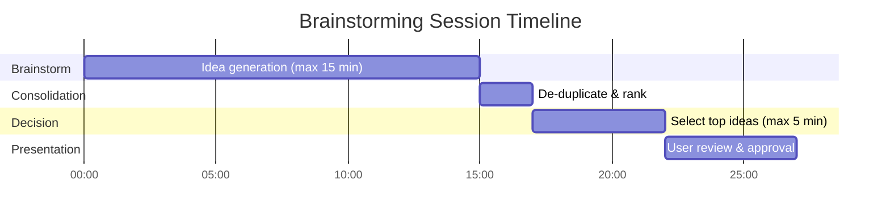

# BrainstormingFlow

**File:** `backend/flows/brainstorming_flow.py`
**State Model:** `BrainstormState`
**Purpose:** Time-limited ideation sessions with multi-agent participation for generating new tasks when project objectives are not yet fully met.

## State Model

| Field | Type | Description |
|-------|------|-------------|
| `project_id` | str | Parent project ID |
| `participants` | list | Participating agent roles |
| `ideas` | list | Raw ideas from brainstorm rounds |
| `consolidated_ideas` | list | De-duplicated and ranked ideas |
| `selected_ideas` | list | Top ideas selected for implementation |
| `start_time` | float | Session start timestamp |
| `phase` | str | `BRAINSTORM` / `CONSOLIDATION` / `DECISION` / `PRESENTATION` / `COMPLETE` |
| `time_limit_brainstorm` | int | Brainstorm phase time limit (default: 900s = 15 min) |
| `time_limit_decision` | int | Decision phase time limit (default: 300s = 5 min) |
| `user_approved` | bool | Whether user approved selected ideas |
| `user_feedback` | str | User feedback on rejection |
| `round_count` | int | Current brainstorm round |
| `max_rounds` | int | Maximum brainstorm rounds (default: 5) |

## Flow Diagram

## Brainstorm Phase Detail

## Phase Progression

## Time Constraints

## Key Decision Points

1. **Time/Round Limits** - Brainstorm phase ends after 5 rounds or 15 minutes, whichever comes first.
2. **Decision Timeout** - If Team Lead can't decide within 5 minutes, top 3 consolidated ideas are used.
3. **User Approval** - User must approve selected ideas. Rejection restarts the entire brainstorm with feedback.

## Agent Responsibilities

| Agent | Actions |
|-------|---------|
| **Team Lead** | Proposes ideas, consolidates/ranks, selects top ideas, creates tasks from approved ideas |
| **Developer** | Proposes ideas during brainstorm rounds |
| **Researcher** | Proposes ideas during brainstorm rounds |
| **Project Lead** | Presents selected ideas to user for approval |
