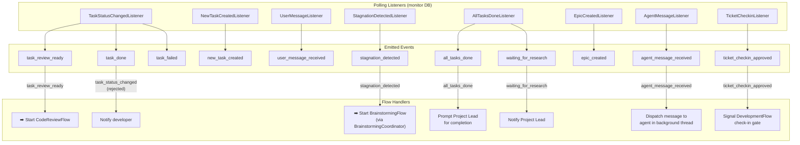
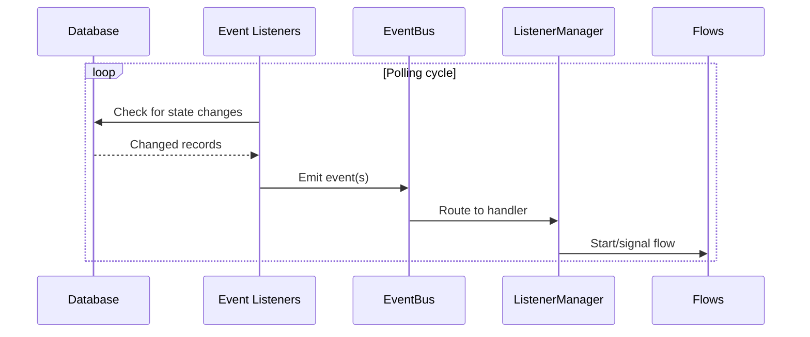
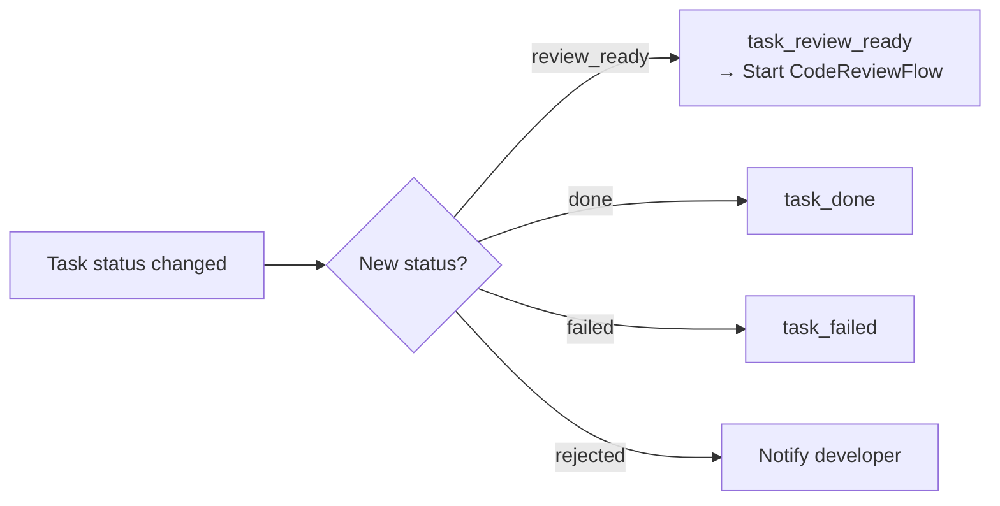
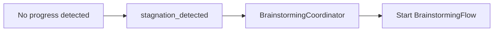
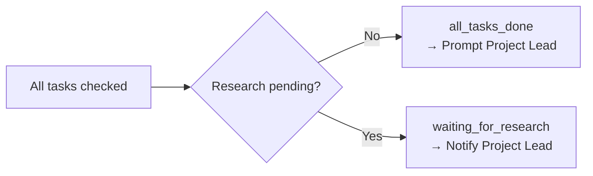
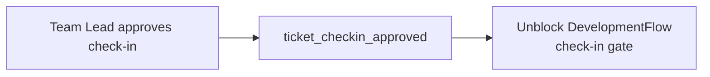

# Event System & Flow Triggering

**File:** `backend/flows/event_listeners.py`
**Purpose:** Event-driven architecture that connects flows, agents, and external triggers through an EventBus with polling-based listeners.

## Event Listeners

## Event Flow Connections

## Listener Details

### TaskStatusChangedListener
Monitors task status changes and emits appropriate events.

### StagnationDetectedListener
Detects when a project is stagnating (no progress over time).

### AllTasksDoneListener
Checks if all tasks in the project are complete.

### TicketCheckinListener
Monitors check-in approvals for the DevelopmentFlow gate.

## Event-to-Flow Mapping

| Event | Source Listener | Target Flow/Action |
|-------|----------------|-------------------|
| `task_review_ready` | TaskStatusChangedListener | Start **CodeReviewFlow** |
| `task_status_changed` (rejected) | TaskStatusChangedListener | Notify developer of rejection |
| `task_done` | TaskStatusChangedListener | (Tracked by MainProjectFlow) |
| `task_failed` | TaskStatusChangedListener | (Error handling) |
| `new_task_created` | NewTaskCreatedListener | (Tracked by MainProjectFlow) |
| `user_message_received` | UserMessageListener | Route to appropriate agent |
| `stagnation_detected` | StagnationDetectedListener | Start **BrainstormingFlow** |
| `all_tasks_done` | AllTasksDoneListener | Prompt Project Lead for completion |
| `waiting_for_research` | AllTasksDoneListener | Notify Project Lead |
| `epic_created` | EpicCreatedListener | (Tracked by MainProjectFlow) |
| `agent_message_received` | AgentMessageListener | Dispatch to agent in background |
| `ticket_checkin_approved` | TicketCheckinListener | Unblock **DevelopmentFlow** gate |

## Wiring (ListenerManager)

The `ListenerManager.wire_flow_handlers()` method connects events to flow handlers at startup. This is the central point where the reactive event system is configured.
