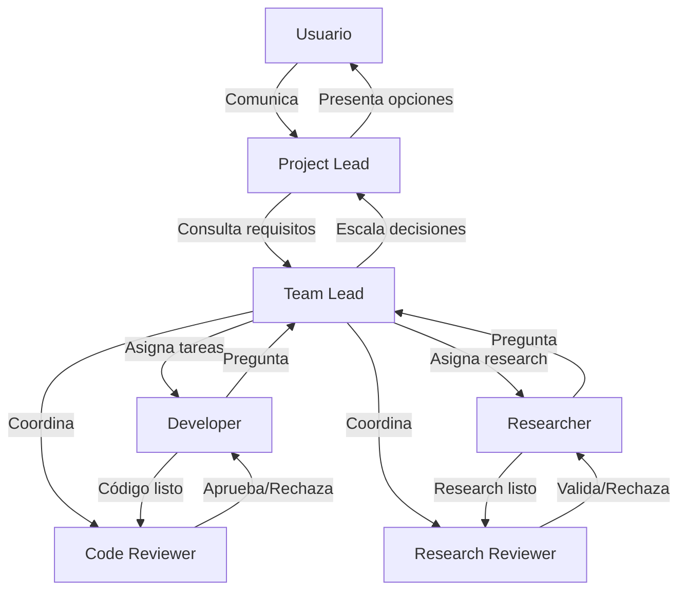

# Agents Implementation

## Overview

The `backend/agents/` module defines six specialized CrewAI agents wrapped in a `PabadaAgent` base class that adds PABADA-specific behaviour: roster registration, agent run tracking, memory persistence, and execution context management.

## Module Structure

```
backend/agents/
├── __init__.py            # Public API re-exports
├── base.py                # PabadaAgent wrapper class
├── project_lead.py        # Project Lead agent factory
├── team_lead.py           # Team Lead agent factory
├── developer.py           # Developer agent factory
├── code_reviewer.py       # Code Reviewer agent factory
├── researcher.py          # Researcher agent factory
├── research_reviewer.py   # Research Reviewer agent factory
└── registry.py            # Roster CRUD and agent run tracking
```

## Agent Roles

| Agent | Purpose | Delegation | Max Iter |
|-------|---------|------------|----------|
| **Project Lead** | Bridge between user and team. Only agent that talks to the user. | No | 20 |
| **Team Lead** | Technical coordinator. Decomposes work into epics/milestones/tasks. | Yes | 25 |
| **Developer** | Implements code following ticket specs. Follows strict git workflow. | No | 20 |
| **Code Reviewer** | Reviews code for quality, security, and spec compliance. | No | 15 |
| **Researcher** | Conducts scientific research with hypotheses and findings. | No | 25 |
| **Research Reviewer** | Peer-reviews research for methodological rigor. | No | 15 |

## Tools by Role

| Tool Category | Project Lead | Team Lead | Developer | Code Reviewer | Researcher | Research Reviewer |
|---------------|:---:|:---:|:---:|:---:|:---:|:---:|
| File Tools | - | Y | Y | Y | Y | - |
| Git Tools | - | Y | Y | Y (diff/status) | - | - |
| Task Tools | Y | Y | Y (subset) | Y (review) | Y (subset) | Y (review) |
| Communication | Y | Y | Y (subset) | Y (subset) | Y (subset) | Y (subset) |
| Web Tools | - | - | Y | - | Y | - |
| Shell Tools | - | - | Y | - | - | - |
| Memory Tools | Y | Y | Y | Y | Y | Y |
| Knowledge | Y (read) | Y (read) | - | - | Y (full) | Y (review) |
| Project Tools | Y | Y | - | - | - | - |

## Usage

### Creating a single agent

```python
from backend.agents.developer import create_developer_agent

agent = create_developer_agent("dev-001", project_id=1)
agent.register_in_roster()
agent.activate_context(task_id=42)

# Get the underlying CrewAI Agent for use in Crews
crewai_agent = agent.crewai_agent
```

### Using the registry

```python
from backend.agents.registry import get_agent_by_role, get_all_agents

# Single agent (auto-registered)
dev = get_agent_by_role("developer", project_id=1)

# All agents for a project
agents = get_all_agents(project_id=1)
team_lead = agents["team_lead"]
```

### Tracking agent runs

```python
agent = get_agent_by_role("developer", project_id=1)
run_id = agent.create_agent_run(task_id=5)

# ... agent executes ...

agent.complete_agent_run(run_id, status="completed", tokens_used=1200)
```

### Standalone run tracking (without PabadaAgent instance)

```python
from backend.agents.registry import (
    register_agent,
    create_agent_run_record,
    complete_agent_run,
)

register_agent("dev-003", "Developer 3", "developer")
run_id = create_agent_run_record("dev-003", project_id=1, task_id=10, role="developer")
complete_agent_run(run_id, status="completed", tokens_used=800)
```

### Memory persistence

```python
agent.update_memory("User prefers TypeScript over JavaScript")
later = agent.load_memory()  # "User prefers TypeScript over JavaScript"
```

## Interaction Diagram



## Database Tables

- **`roster`**: Agent identity, role, status, memory, run count.
- **`agent_runs`**: Individual execution records with timing and token usage.
- **`agent_performance`**: Aggregated performance metrics per agent.

## Troubleshooting

| Problem | Cause | Fix |
|---------|-------|-----|
| `ValueError: Unknown role` | Typo in role string | Use one of: `project_lead`, `team_lead`, `developer`, `code_reviewer`, `researcher`, `research_reviewer` |
| `ValueError: No project_id in context` | Tools called before `activate_context()` | Call `agent.activate_context()` before executing tasks |
| `sqlite3.IntegrityError` on agent_runs | Missing project or task FK | Ensure the project and task exist in DB first |
| Agent has wrong tools | Role mismatch | Check `_ROLE_TOOLS` in `backend/tools/__init__.py` |
