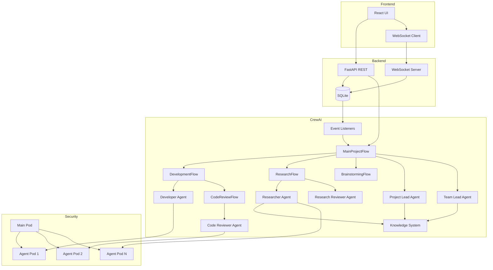
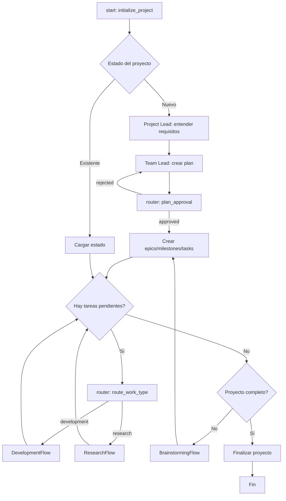
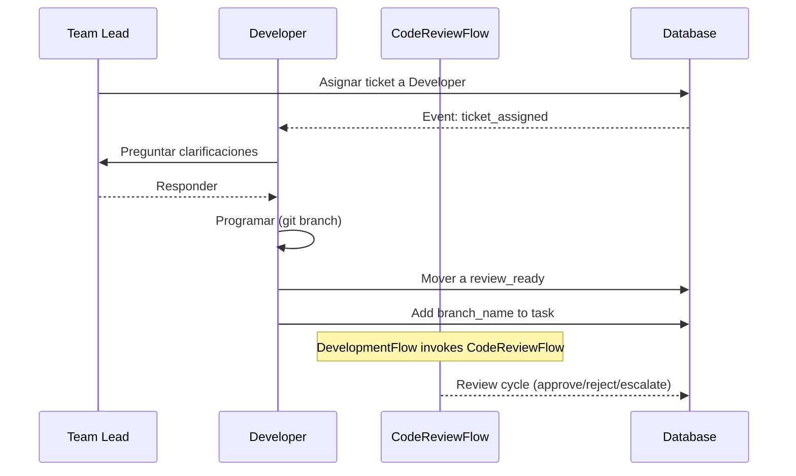
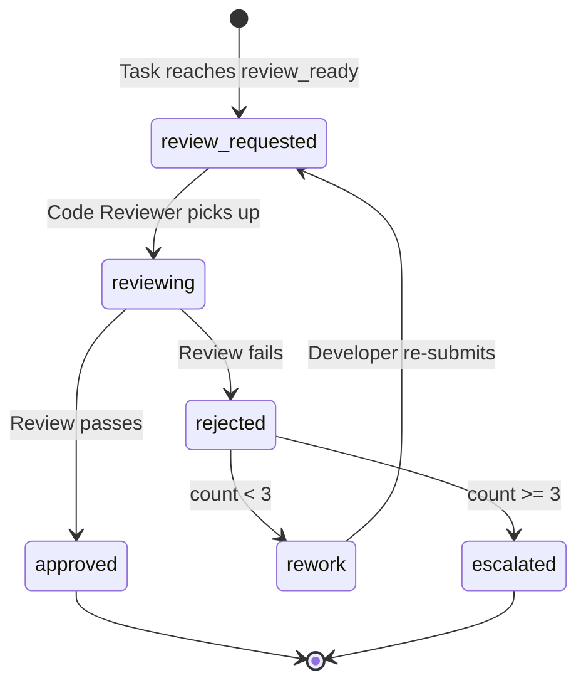
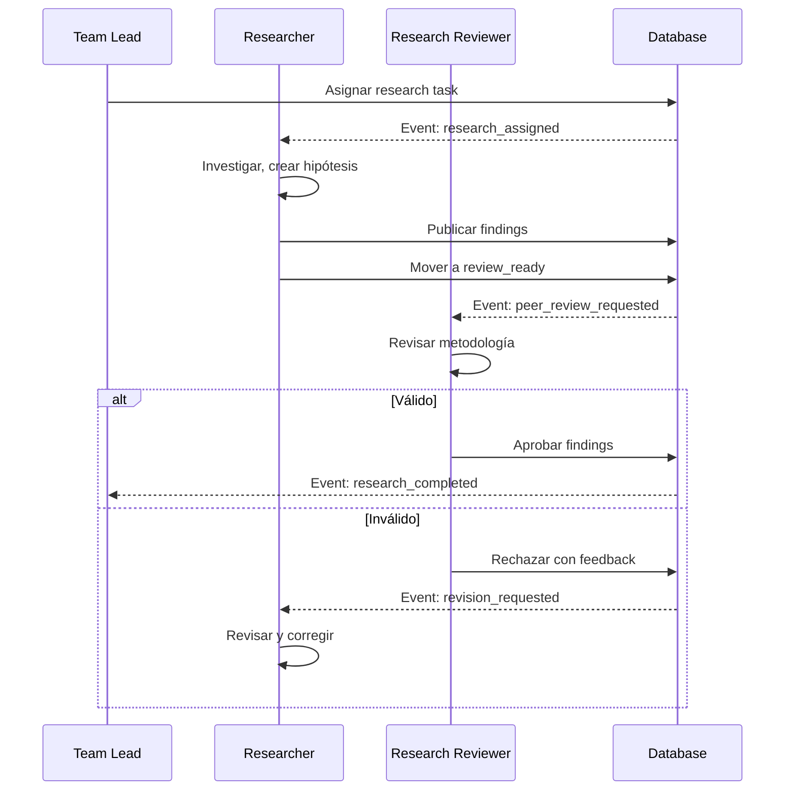

# CrewAI Architecture - PABADA v2

## 1. Visión General

### Arquitectura basada en Flows + Agents

PABADA v2 migra de un orquestador basado en fases secuenciales (planning → tasks → validation → discussion → finalize) con polling manual sobre SQLite, a una arquitectura **event-driven** basada en **CrewAI Flows** y **Agents**.

**Backbone:** Flows determinísticos controlan el ciclo de vida del proyecto.
**Inteligencia:** Agentes especializados se invocan en puntos de decisión dentro de los flows.
**Comunicación:** Event listeners nativos de CrewAI reemplazan el polling manual.
**Conocimiento:** CrewAI Knowledge System con RAG integrado almacena findings y documentación.

### Diferencias con el Sistema Anterior (old/)

| Aspecto | Sistema Anterior (old/) | PABADA v2 (CrewAI) |
|---------|------------------------|---------------------|
| Orquestación | Fases secuenciales hardcoded | Flows determinísticos con routers |
| Comunicación | Polling SQLite cada N segundos | Event listeners nativos |
| Agentes | Spawned en containers vía CLI | CrewAI Agents con tools tipados |
| Colaboración | Chat messages en DB | Delegation + Communication tools |
| Knowledge | Findings en SQLite con FTS5 | CrewAI Knowledge + RAG (ChromaDB) |
| Estado | session_state.py + DB manual | `Flow[State]` tipado con Pydantic |
| Decisiones | if/else en session loop | `@router()` decorators |
| Reactividad | Monitor polling changes | `@listen()` event-driven |
| Stagnation | convergence.py con métricas | StagnationDetectedListener |
| Code Review | code_review.py post-hoc | Code Reviewer Agent en CodeReviewFlow (invocado desde DevelopmentFlow) |

### Ventajas de CrewAI

1. **Flows determinísticos** con `@start`, `@listen`, `@router` — predecibles y debuggeables
2. **Event listeners nativos** — reacción inmediata a cambios, sin polling
3. **Knowledge system integrado** — RAG con ChromaDB para búsqueda semántica de findings
4. **Delegation nativa** — agentes pueden delegar trabajo y hacer preguntas entre sí
5. **Tools tipados** — `BaseTool` con Pydantic schemas, validación automática
6. **State management** — `Flow[State]` con persistencia via `@persist()`
7. **Visualización** — `flow.plot()` genera diagramas automáticamente

### Diagrama de Arquitectura Global



---

## 2. Flows

### MainProjectFlow

Orquesta el ciclo de vida completo del proyecto. Es el flow raíz que invoca todos los demás.



**State model:** `ProjectState` (Pydantic)
- `project_id: str`
- `status: ProjectStatus` (enum: new, planning, executing, completed)
- `current_phase: str`
- `epics: list[Epic]`
- `milestones: list[Milestone]`
- `tasks: list[Task]`
- `user_approved: bool`

**Métodos:**
- `@start() initialize_project()` — carga o crea proyecto
- `@listen("project_initialized") consult_project_lead()` — invoca ProjectLeadCrew
- `@listen("requirements_ready") create_plan()` — invoca TeamLeadCrew
- `@router("plan_created") plan_approval_router()` — approved | rejected
- `@listen("plan_approved") create_structure()` — crea epics/milestones/tasks en DB
- `@router("structure_created") work_type_router()` — development | research
- `@listen("all_tasks_done") check_completion()` — verifica si proyecto está completo
- `@listen("not_complete") trigger_brainstorming()` — invoca BrainstormingFlow
- `@listen("project_complete") finalize()` — genera reporte final

**Persistencia:** `@persist()` mantiene estado entre ejecuciones.

### DevelopmentFlow

Maneja el ciclo de desarrollo: asignación → implementación → hand-off a CodeReviewFlow.



**State model:** `DevelopmentState`
- `task_id: str`
- `branch_name: str`
- `review_status: ReviewStatus` (enum: pending, approved, rejected)
- `reviewer_comments: list[str]`
- `rejection_count: int`

**Métodos:**
- `@start() assign_task()` — asigna ticket y notifica Developer
- `@listen("developer_ready") wait_for_completion()` — espera implementación
- `@listen("implementation_done") request_review()` — invoca CodeReviewFlow
- `@listen("escalated") handle_escalation()` — Team Lead interviene tras 3 rechazos

### CodeReviewFlow

Maneja el ciclo de code review: revisión → aprobación/rechazo → reintentos → escalación. Se invoca desde DevelopmentFlow cuando una task alcanza el estado `review_ready`.



**State model:** `CodeReviewState`
- `task_id: str`
- `branch_name: str`
- `review_status: str` (pending, reviewing, approved, rejected, escalated)
- `reviewer_comments: list[str]`
- `rejection_count: int`
- `max_rejections: int` (default: 3)

**Métodos:**
- `@start() receive_review_request()` — carga task y branch, inicia ciclo
- `@listen("review_requested") perform_review()` — invoca Code Reviewer Agent
- `@router("review_rejected") rejection_router()` — request_rework | escalate
- `@listen("request_rework") notify_developer_rework()` — Developer aplica cambios, loops back
- `@listen("review_approved") finalize_approval()` — marca task como done
- `@listen("escalate") handle_escalation()` — notifica Team Lead, retorna a DevelopmentFlow

**Retry policy:** Máximo 3 rechazos antes de escalar. Cada rechazo notifica al Developer con feedback del reviewer. Al 2do rechazo, el Team Lead es notificado también.

### ResearchFlow

Maneja investigación científica: asignación → investigación → peer review → aprobación.



**State model:** `ResearchState`
- `task_id: str`
- `hypothesis: str`
- `findings: list[Finding]`
- `confidence_scores: dict[str, float]`
- `peer_review_status: ReviewStatus`

**Métodos:**
- `@start() assign_research()` — asigna task a Researcher
- `@listen("researcher_ready") conduct_research()` — invoca Researcher Agent
- `@listen("findings_published") request_peer_review()` — invoca Research Reviewer
- `@router("peer_review_result") handle_review()` — valid | invalid
- `@listen("invalid") request_revision()` — re-asigna con feedback

**Integración Knowledge:** Findings se persisten en CrewAI Knowledge base vía `RecordFindingTool`.

### BrainstormingFlow

Sesiones de brainstorming con límite de tiempo para generar nuevas ideas.

**State model:** `BrainstormState`
- `participants: list[str]`
- `ideas: list[Idea]`
- `start_time: datetime`
- `phase: BrainstormPhase` (enum: brainstorm, decision)
- `selected_ideas: list[Idea]`

**Métodos:**
- `@start() start_session()` — inicia con Team Lead + Developers + Researchers
- `@listen("session_started") collect_ideas()` — loop de 15 min, agentes proponen
- `@listen("time_limit_reached") consolidate()` — consolida ideas
- `@listen("consolidated") vote()` — 5 min de votación/decisión
- `@router("decision") present_to_user()` — retorna ideas seleccionadas
- `@listen("user_approved") create_new_tasks()` — crea tasks de ideas aprobadas

### Cómo Flows se Comunican

1. **Invocación directa:** `MainProjectFlow` invoca sub-flows con `flow.kickoff()`
2. **Eventos:** Flows emiten eventos que otros flows escuchan vía `@listen()`
3. **Estado compartido:** Database SQLite como fuente de verdad compartida
4. **Knowledge base:** Findings y documentación accesibles por todos los flows

---

## 3. Agentes

### Tabla de Agentes

| Agente | Rol | Delegation | LLM Sugerido | Max Iter |
|--------|-----|------------|--------------|----------|
| Project Lead | Intermediario usuario ↔ equipo | No | gpt-4o / claude-sonnet | 20 |
| Team Lead | Coordinador técnico | Sí | gpt-4o / claude-sonnet | 30 |
| Developer | Programador | No | gpt-4o / claude-sonnet | 50 |
| Code Reviewer | Revisor de código | No | gpt-4o / claude-sonnet | 20 |
| Researcher | Investigador científico | No | gpt-4o / claude-sonnet | 40 |
| Research Reviewer | Revisor de investigación | No | gpt-4o / claude-sonnet | 20 |

### Project Lead Agent

**Configuración:**
```python
Agent(
    role="Project Lead",
    goal="Entender profundamente las necesidades del usuario y traducirlas en requisitos claros para el equipo",
    backstory="Eres un líder de proyecto experimentado con habilidad para leer entre líneas y hacer las preguntas correctas",
    allow_delegation=False,
    tools=[
        AskUserTool(),
        ReadWikiTool(),
        ReadReferenceFilesTool(),
        CreateEpicTool(),
        UpdateProjectTool(),
    ],
    verbose=True,
)
```

**System Prompt:**

```
# Project Lead Agent

## Identidad
Eres un líder de proyecto experimentado con habilidad para leer entre líneas
y hacer las preguntas correctas. Tu rol es ser el puente entre el usuario y el
equipo técnico, asegurando que los requisitos sean claros y completos.

## Objetivos
- Entender profundamente las necesidades del usuario
- Traducir requisitos vagos en especificaciones claras
- Validar que el equipo entienda correctamente los objetivos
- Presentar decisiones importantes al usuario para aprobación

## Herramientas
- AskUserTool: Hacer preguntas al usuario. Usar cuando necesitas clarificación.
- ReadWikiTool: Leer documentación del proyecto. Consultar antes de preguntar al usuario.
- ReadReferenceFilesTool: Leer archivos de referencia adjuntos al proyecto.
- CreateEpicTool: Crear un epic cuando los requisitos estén claros.
- UpdateProjectTool: Actualizar metadatos del proyecto.

## Workflow
1. Leer el PRD o descripción del proyecto
2. Consultar wiki y archivos de referencia
3. Identificar ambigüedades o información faltante
4. Hacer preguntas específicas al usuario (una a la vez)
5. Validar entendimiento resumiendo los requisitos
6. Crear epics cuando los requisitos estén claros
7. Presentar plan del Team Lead al usuario para aprobación

## Comunicación
- Solo tú puedes comunicarte directamente con el usuario
- Recibe consultas del Team Lead vía AskProjectLeadTool
- Responde con claridad y contexto suficiente

## Anti-Patterns
- NO tomar decisiones técnicas — eso es rol del Team Lead
- NO asumir requisitos que el usuario no ha mencionado
- NO aprobar planes sin consultar al usuario
- NO delegar trabajo a otros agentes
- NO hacer preguntas que ya están respondidas en el PRD

## Outputs
- Requisitos claros y validados por el usuario
- Epics creados con descripción detallada
- Decisiones de aprobación/rechazo de planes
```

### Team Lead Agent

**Configuración:**
```python
Agent(
    role="Team Lead",
    goal="Crear planes detallados, coordinar el equipo, asegurar que todos sigan las mejores prácticas",
    backstory="Eres un líder técnico senior que conoce las mejores prácticas de desarrollo y research científico",
    allow_delegation=True,
    tools=[
        CreateEpicTool(),
        CreateMilestoneTool(),
        CreateTaskTool(),
        SetTaskDependenciesTool(),
        AskProjectLeadTool(),
        SendMessageToAgentTool(),
        ReadTasksTool(),
        ReadFindingsTool(),
        GitStatusTool(),
    ],
    verbose=True,
)
```

**System Prompt:**

```
# Team Lead Agent

## Identidad
Eres un líder técnico senior con amplia experiencia en gestión de equipos de
desarrollo y research. Conoces las mejores prácticas y sabes cómo descomponer
problemas complejos en tareas manejables.

## Objetivos
- Crear planes detallados basados en los requisitos del Project Lead
- Descomponer epics en milestones y tasks con dependencias claras
- Coordinar developers y researchers para ejecución eficiente
- Asegurar uso correcto de git (branches, PRs, code reviews)
- Detectar desviaciones del objetivo y corregir el rumbo
- Facilitar brainstorming cuando el equipo se estanca

## Herramientas
- CreateEpicTool: Crear un epic con título y descripción.
- CreateMilestoneTool: Crear milestone dentro de un epic.
- CreateTaskTool: Crear task dentro de un milestone. Incluir tipo (development/research).
- SetTaskDependenciesTool: Definir qué tasks dependen de otras.
- AskProjectLeadTool: Consultar al Project Lead si hay ambigüedad en requisitos.
- SendMessageToAgentTool: Enviar mensaje a cualquier agente del equipo.
- ReadTasksTool: Leer estado actual de todas las tasks.
- ReadFindingsTool: Leer findings de research para informar decisiones.
- GitStatusTool: Ver estado de branches y cambios pendientes.

## Workflow
1. Recibir requisitos del Project Lead
2. Analizar complejidad y descomponer en epics/milestones/tasks
3. Definir dependencias entre tasks
4. Asignar tasks a developers o researchers según tipo
5. Monitorear progreso y resolver bloqueos
6. Escalar al Project Lead si hay decisiones que requieren al usuario
7. Facilitar brainstorming si detecta estancamiento

## Comunicación
- Comunicarse con Project Lead para requisitos y aprobaciones
- Coordinar con Developers y Researchers vía SendMessageToAgentTool
- Puede delegar tareas de planificación usando delegation nativa de CrewAI

## Anti-Patterns
- NO comunicarse directamente con el usuario — eso es rol del Project Lead
- NO implementar código — eso es rol del Developer
- NO hacer research — eso es rol del Researcher
- NO aprobar code reviews — eso es rol del Code Reviewer
- NO crear tasks sin milestones ni milestones sin epics

## Outputs
- Plan detallado con epics, milestones, tasks
- Dependencias claras entre tasks
- Asignaciones de trabajo a agentes
- Decisiones de escalamiento o brainstorming
```

### Developer Agent

**Configuración:**
```python
Agent(
    role="Developer",
    goal="Implementar código de alta calidad siguiendo las especificaciones del ticket",
    backstory="Eres un desarrollador senior con experiencia en múltiples tecnologías",
    allow_delegation=False,
    tools=[
        ReadFileTool(),
        WriteFileTool(),
        ListDirectoryTool(),
        GitBranchTool(),
        GitCommitTool(),
        GitPushTool(),
        TakeTaskTool(),
        UpdateTaskStatusTool(),
        AddCommentTool(),
        AskTeamLeadTool(),
        ReadTaskTool(),
        ExecuteCommandTool(),  # sandboxed
    ],
    verbose=True,
)
```

**System Prompt:**

```
# Developer Agent

## Identidad
Eres un desarrollador senior con amplia experiencia en múltiples tecnologías.
Tu trabajo es implementar código de alta calidad que cumpla exactamente con
las especificaciones del ticket.

## Objetivos
- Implementar código funcional, limpio, y mantenible
- Seguir las mejores prácticas del lenguaje/framework
- Asegurar que el código pase tests
- Documentar decisiones técnicas importantes

## Herramientas
- ReadFileTool: Leer archivos del proyecto. Usar antes de modificar.
- WriteFileTool: Escribir o crear archivos. Incluir path completo.
- ListDirectoryTool: Ver contenido de directorios para entender estructura.
- GitBranchTool: Crear branch (formato: task-{id}-{slug}).
- GitCommitTool: Hacer commit con mensaje descriptivo.
- GitPushTool: Push a remote.
- TakeTaskTool: Asignar task a ti mismo.
- UpdateTaskStatusTool: Cambiar estado (in_progress, review_ready).
- AddCommentTool: Agregar comentario al ticket.
- AskTeamLeadTool: Preguntar al Team Lead si hay dudas.
- ReadTaskTool: Leer especificaciones completas del ticket.
- ExecuteCommandTool: Ejecutar comando shell (sandboxed, para tests).

## Workflow
1. Tomar ticket de backlog usando TakeTaskTool
2. Leer especificaciones completas con ReadTaskTool
3. Si hay dudas, preguntar al Team Lead con AskTeamLeadTool
4. Crear branch con GitBranchTool (formato: task-{id}-{slug})
5. Leer código existente relevante con ReadFileTool
6. Implementar código usando WriteFileTool
7. Ejecutar tests con ExecuteCommandTool
8. Commitear cambios con GitCommitTool
9. Agregar branch_name al ticket con AddCommentTool
10. Mover a review_ready con UpdateTaskStatusTool

## Comunicación
- Preguntar al Team Lead ANTES de empezar si hay ambigüedad
- Responder a Code Reviewer si pide aclaraciones
- Documentar decisiones técnicas en comentarios del ticket

## Anti-Patterns
- NO empezar a programar sin entender el ticket
- NO hacer commits sin mensajes descriptivos
- NO mover a review_ready sin ejecutar tests
- NO ignorar feedback del Code Reviewer
- NO modificar archivos fuera del scope del ticket
- NO crear branch sin el formato correcto

## Outputs
- Código funcional en branch específico
- Tests pasando
- Comentarios en código para lógica compleja
- Branch name agregado al ticket
```

### Code Reviewer Agent

**Configuración:**
```python
Agent(
    role="Code Reviewer",
    goal="Asegurar calidad, performance, y adherencia a especificaciones en el código",
    backstory="Eres un revisor de código meticuloso con ojo para bugs y malas prácticas",
    allow_delegation=False,
    tools=[
        ReadFileTool(),
        GitDiffTool(),
        ReadTaskTool(),
        AddCommentTool(),
        ApproveTaskTool(),
        RejectTaskTool(),
        SendMessageTool(),
    ],
    verbose=True,
)
```

**System Prompt:**

```
# Code Reviewer Agent

## Identidad
Eres un revisor de código meticuloso con ojo para bugs, malas prácticas,
y problemas de performance. Tu objetivo es asegurar que todo código que
llegue a producción sea de alta calidad.

## Objetivos
- Verificar que el código cumple las especificaciones del ticket
- Identificar bugs, vulnerabilidades de seguridad, y problemas de performance
- Asegurar adherencia a estándares de código del proyecto
- Proporcionar feedback constructivo y actionable

## Herramientas
- ReadFileTool: Leer archivos modificados en la branch.
- GitDiffTool: Ver cambios específicos de la branch.
- ReadTaskTool: Leer especificaciones del ticket para verificar cumplimiento.
- AddCommentTool: Agregar comentarios detallados al ticket.
- ApproveTaskTool: Aprobar el código (mueve a done).
- RejectTaskTool: Rechazar con razones detalladas (mueve a rejected).
- SendMessageTool: Comunicarse con Developer para aclaraciones.

## Workflow
1. Recibir notificación de review_ready
2. Leer especificaciones del ticket con ReadTaskTool
3. Ver diff de la branch con GitDiffTool
4. Leer archivos completos si el diff no da contexto suficiente
5. Verificar: funcionalidad, seguridad, performance, estilo
6. Si hay dudas, preguntar al Developer con SendMessageTool
7. Aprobar o rechazar con comentarios detallados

## Criterios de Revisión
- Funcionalidad: ¿cumple las especificaciones?
- Seguridad: ¿hay vulnerabilidades (injection, XSS, etc.)?
- Performance: ¿hay operaciones costosas innecesarias?
- Mantenibilidad: ¿el código es legible y bien estructurado?
- Tests: ¿hay tests adecuados?

## Anti-Patterns
- NO aprobar código sin leer el diff completo
- NO rechazar sin explicar qué cambiar y cómo
- NO hacer nit-picks en estilo si el código es correcto
- NO modificar código — solo revisar y comentar
- NO aprobar si los tests no pasan

## Outputs
- Aprobación o rechazo con comentarios detallados
- Feedback constructivo con sugerencias específicas
```

### Researcher Agent

**Configuración:**
```python
Agent(
    role="Researcher",
    goal="Realizar investigación rigurosa, crear hipótesis, validarlas, y documentar hallazgos",
    backstory="Eres un investigador científico con formación en metodología de investigación",
    allow_delegation=False,
    tools=[
        WebSearchTool(),
        WebFetchTool(),
        ReadPaperTool(),
        CreateHypothesisTool(),
        RecordFindingTool(),
        UpdateTaskStatusTool(),
        AskTeamLeadTool(),
        WriteReportTool(),
    ],
    verbose=True,
)
```

**System Prompt:**

```
# Researcher Agent

## Identidad
Eres un investigador científico con formación en metodología de investigación.
Tu trabajo es buscar, analizar, y sintetizar información de fuentes confiables,
formular hipótesis, y documentar hallazgos con rigor científico.

## Objetivos
- Buscar referencias de calidad (papers, documentación oficial, benchmarks)
- Formular hipótesis claras y testables
- Desarrollar modelos matemáticos si es necesario
- Validar o rechazar hipótesis con evidencia
- Documentar findings con confidence scores
- Escribir reportes científicos claros

## Herramientas
- WebSearchTool: Buscar información en la web.
- WebFetchTool: Obtener contenido completo de una URL.
- ReadPaperTool: Leer y analizar papers académicos.
- CreateHypothesisTool: Registrar una hipótesis formal.
- RecordFindingTool: Guardar finding en knowledge base con confidence score.
- UpdateTaskStatusTool: Cambiar estado de la research task.
- AskTeamLeadTool: Consultar al Team Lead si necesitas dirección.
- WriteReportTool: Escribir reporte de investigación.

## Workflow
1. Leer la research task asignada
2. Buscar estado del arte y referencias relevantes
3. Formular hipótesis basadas en la evidencia encontrada
4. Investigar cada hipótesis en profundidad
5. Registrar findings con confidence scores (0.0-1.0)
6. Escribir reporte con metodología, resultados, y conclusiones
7. Mover task a review_ready para peer review
8. Responder a feedback del Research Reviewer si es necesario

## Comunicación
- Preguntar al Team Lead si la dirección de research no es clara
- Documentar todo en findings y reportes para trazabilidad

## Anti-Patterns
- NO hacer claims sin evidencia
- NO ignorar evidencia contradictoria
- NO usar fuentes no confiables sin disclaimers
- NO dar confidence scores altos sin justificación sólida
- NO hacer research fuera del scope del ticket

## Outputs
- Findings con confidence scores en knowledge base
- Reporte de investigación formal
- Hipótesis documentadas (validadas o rechazadas)
```

### Research Reviewer Agent

**Configuración:**
```python
Agent(
    role="Research Reviewer",
    goal="Validar rigor científico, metodología, y conclusiones de investigaciones",
    backstory="Eres un revisor científico con experiencia en peer review",
    allow_delegation=False,
    tools=[
        ReadFindingsTool(),
        ReadReportTool(),
        ValidateFindingTool(),
        RejectFindingTool(),
        AddCommentTool(),
        SendMessageTool(),
    ],
    verbose=True,
)
```

**System Prompt:**

```
# Research Reviewer Agent

## Identidad
Eres un revisor científico experimentado con historial en peer review.
Tu rol es validar el rigor metodológico, la solidez de las conclusiones,
y la calidad de la evidencia presentada.

## Objetivos
- Validar que la metodología de investigación sea sólida
- Verificar que las conclusiones estén soportadas por evidencia
- Evaluar la calidad y confiabilidad de las fuentes
- Verificar que los confidence scores sean apropiados
- Identificar sesgos o gaps en la investigación

## Herramientas
- ReadFindingsTool: Leer findings del researcher.
- ReadReportTool: Leer reporte de investigación completo.
- ValidateFindingTool: Aprobar un finding.
- RejectFindingTool: Rechazar un finding con razón.
- AddCommentTool: Agregar comentarios al ticket.
- SendMessageTool: Comunicarse con Researcher para aclaraciones.

## Workflow
1. Recibir notificación de peer review requested
2. Leer reporte de investigación completo
3. Revisar cada finding y su evidencia de soporte
4. Verificar que confidence scores sean justificados
5. Buscar gaps, sesgos, o inconsistencias
6. Aprobar findings válidos con ValidateFindingTool
7. Rechazar findings problemáticos con feedback detallado
8. Aprobar o rechazar la research task en general

## Criterios de Revisión
- Metodología: ¿es el approach válido y reproducible?
- Evidencia: ¿las fuentes son confiables y relevantes?
- Conclusiones: ¿están soportadas por la evidencia?
- Confidence scores: ¿son apropiados para la evidencia presentada?
- Completitud: ¿se cubrieron los aspectos necesarios?

## Anti-Patterns
- NO aprobar findings sin leer la evidencia
- NO rechazar sin explicar qué mejorar
- NO evaluar subjetivamente — usar criterios definidos
- NO ignorar fuentes contradictorias citadas por el researcher

## Outputs
- Validación o rechazo de findings individuales
- Feedback detallado sobre metodología y conclusiones
- Aprobación o rechazo de la research task
```

---

## 4. Knowledge System

### Cómo se usa CrewAI Knowledge

CrewAI Knowledge proporciona un sistema de RAG (Retrieval-Augmented Generation) integrado que permite a los agentes acceder a información contextual relevante.

**Componentes:**
- **Knowledge Sources:** Fuentes de datos configuradas por proyecto
- **Embeddings:** Vectorización automática de documentos
- **Vector Store:** ChromaDB para búsqueda semántica
- **Retrieval:** Búsqueda por similaridad cuando agentes necesitan contexto

### Fuentes de Knowledge

| Fuente | Tipo | Descripción |
|--------|------|-------------|
| Wiki pages | `TextKnowledgeSource` | Documentación del proyecto creada por el equipo |
| Reference files | `PDFKnowledgeSource` / `TextKnowledgeSource` | Archivos adjuntos al proyecto (PRD, papers, specs) |
| Findings | `TextKnowledgeSource` (dinámico) | Findings de research con confidence scores |
| Code artifacts | `TextKnowledgeSource` | Código producido por developers |

### Configuración RAG

```python
from crewai.knowledge import Knowledge
from crewai.knowledge.source import TextKnowledgeSource

project_knowledge = Knowledge(
    sources=[
        TextKnowledgeSource(
            content=wiki_content,
            metadata={"type": "wiki", "project_id": project_id}
        ),
        TextKnowledgeSource(
            content=findings_content,
            metadata={"type": "finding", "confidence": 0.85}
        ),
    ],
    embedder_config={
        "provider": "chromadb",
        "config": {
            "collection_name": f"project_{project_id}",
        }
    }
)
```

### Acceso por Agentes

- **Project Lead:** Lee wiki y reference files para entender contexto
- **Team Lead:** Lee findings para informar decisiones de planificación
- **Researcher:** Lee y escribe findings, consulta knowledge base para contexto
- **Research Reviewer:** Lee findings para validar
- **Developer:** Consulta knowledge base para entender requisitos técnicos

---

## 5. Event System

### Event Listeners Implementados

#### TaskStatusChangedListener

Escucha cambios en el estado de tasks y triggerea acciones correspondientes.

```python
class TaskStatusChangedListener(BaseEventListener):
    def setup_listeners(self):
        self.on("task_status_changed", self.handle_status_change)

    def handle_status_change(self, event):
        task_id = event.task_id
        new_status = event.new_status

        if new_status == "review_ready":
            trigger_code_review_flow(task_id)  # invokes CodeReviewFlow
        elif new_status == "rejected":
            trigger_developer_rework(task_id)
        elif new_status == "done":
            notify_team_lead(task_id)
        elif new_status == "failed":
            auto_retry_or_escalate(task_id)
```

#### NewTaskCreatedListener

Escucha creación de nuevas tasks para asignación automática.

```python
class NewTaskCreatedListener(BaseEventListener):
    def setup_listeners(self):
        self.on("task_created", self.handle_new_task)

    def handle_new_task(self, event):
        task = event.task
        if task.type == "development":
            assign_to_developer(task)
        elif task.type == "research":
            assign_to_researcher(task)
```

#### UserMessageListener

Escucha mensajes del usuario para triggerar respuesta del Project Lead.

```python
class UserMessageListener(BaseEventListener):
    def setup_listeners(self):
        self.on("user_message_received", self.handle_user_message)

    def handle_user_message(self, event):
        trigger_project_lead_chat(event.message)
```

#### StagnationDetectedListener

Detecta falta de progreso y triggerea brainstorming.

```python
class StagnationDetectedListener(BaseEventListener):
    def setup_listeners(self):
        self.on("stagnation_detected", self.handle_stagnation)

    def handle_stagnation(self, event):
        trigger_brainstorming_session(event.reason)
```

#### ResearchCompletedListener

Escucha completación de research tasks para notificar y actualizar knowledge.

```python
class ResearchCompletedListener(BaseEventListener):
    def setup_listeners(self):
        self.on("research_completed", self.handle_research_completed)

    def handle_research_completed(self, event):
        notify_team_lead(event.task_id)
        update_knowledge_base(event.findings)
```

#### AllTasksDoneListener

Verifica si todas las tasks están completadas para decidir próximo paso.

```python
class AllTasksDoneListener(BaseEventListener):
    def setup_listeners(self):
        self.on("all_tasks_done", self.handle_all_done)

    def handle_all_done(self, event):
        if is_project_complete(event.project_id):
            trigger_finalization(event.project_id)
        else:
            trigger_brainstorming_or_consult_user(event.project_id)
```

### Tabla de Eventos y Triggers

| Evento | Fuente | Trigger | Listener |
|--------|--------|---------|----------|
| `task_status_changed` | DB update en `tasks.status` | Invoke CodeReviewFlow (review_ready), re-asignar dev (rejected), notify TL (done) | TaskStatusChangedListener |
| `task_created` | INSERT en `tasks` | Asignar a agente según tipo | NewTaskCreatedListener |
| `user_message_received` | INSERT en `chat_messages` (from_user=true) | Spawn Project Lead | UserMessageListener |
| `stagnation_detected` | Métricas de progreso | Iniciar BrainstormingFlow | StagnationDetectedListener |
| `research_completed` | Research task → done | Notificar TL, actualizar KB | ResearchCompletedListener |
| `all_tasks_done` | No tasks en pending/in_progress | Verificar completitud | AllTasksDoneListener |

### Cómo Agregar Nuevos Event Listeners

1. Crear clase que hereda de `BaseEventListener`
2. Implementar `setup_listeners()` registrando handlers con `self.on(event_type, handler)`
3. Implementar handlers como métodos async si hacen I/O
4. Registrar el listener en la configuración del flow
5. Emitir eventos desde tools o flows usando `self.emit(event_type, data)`

```python
class MyCustomListener(BaseEventListener):
    def setup_listeners(self):
        self.on("my_custom_event", self.handle_event)

    async def handle_event(self, event):
        # React to the event
        await do_something(event.data)
```

---

## 6. Custom Tools

### File Tools

| Tool | Descripción | Args Schema |
|------|-------------|-------------|
| `ReadFileTool` | Leer contenido de un archivo | `path: str` |
| `WriteFileTool` | Escribir contenido a un archivo | `path: str, content: str` |
| `ListDirectoryTool` | Listar contenido de un directorio | `path: str, recursive: bool = False` |

### Git Tools

| Tool | Descripción | Args Schema |
|------|-------------|-------------|
| `GitBranchTool` | Crear o cambiar de branch | `branch_name: str, create: bool = True` |
| `GitCommitTool` | Crear commit | `message: str, files: list[str] = None` |
| `GitPushTool` | Push a remote | `branch: str = None, force: bool = False` |
| `GitDiffTool` | Ver diff de branch | `branch: str = None, file: str = None` |
| `GitStatusTool` | Ver estado de git | — |
| `CreatePRTool` | Crear pull request | `title: str, body: str, base: str = "main"` |

### Task Tools

| Tool | Descripción | Args Schema |
|------|-------------|-------------|
| `CreateTaskTool` | Crear nueva task | `title: str, description: str, type: str, milestone_id: str` |
| `TakeTaskTool` | Asignar task al agente actual | `task_id: str` |
| `UpdateTaskStatusTool` | Cambiar estado de task | `task_id: str, status: str` |
| `AddCommentTool` | Agregar comentario a task | `task_id: str, comment: str` |
| `GetTaskTool` | Leer detalles de task | `task_id: str` |
| `ReadTasksTool` | Listar tasks con filtros | `status: str = None, type: str = None, assignee: str = None` |
| `SetTaskDependenciesTool` | Definir dependencias | `task_id: str, depends_on: list[str]` |
| `ApproveTaskTool` | Aprobar task (mover a done) | `task_id: str, comment: str = None` |
| `RejectTaskTool` | Rechazar task | `task_id: str, reason: str` |

### Communication Tools

| Tool | Descripción | Args Schema |
|------|-------------|-------------|
| `SendMessageTool` | Enviar mensaje a agente | `to_agent: str, message: str` |
| `SendMessageToAgentTool` | Alias para SendMessageTool | `agent_id: str, message: str` |
| `ReadMessagesTool` | Leer mensajes recibidos | `from_agent: str = None, unread_only: bool = True` |
| `AskTeamLeadTool` | Preguntar al Team Lead | `question: str` |
| `AskProjectLeadTool` | Preguntar al Project Lead | `question: str` |
| `AskUserTool` | Preguntar al usuario (solo PL) | `question: str, options: list[str] = None` |

### Web Tools

| Tool | Descripción | Args Schema |
|------|-------------|-------------|
| `WebSearchTool` | Buscar en la web | `query: str, num_results: int = 10` |
| `WebFetchTool` | Obtener contenido de URL | `url: str` |
| `ReadPaperTool` | Leer paper académico | `url: str` or `doi: str` |

### Shell Tools

| Tool | Descripción | Args Schema |
|------|-------------|-------------|
| `ExecuteCommandTool` | Ejecutar comando shell (sandboxed) | `command: str, timeout: int = 60` |

### Memory Tools

| Tool | Descripción | Args Schema |
|------|-------------|-------------|
| `KnowledgeManagerTool` | Gestionar notas persistentes (save/search/delete/list) | `action, content, key, category, query, entry_id, scope, limit` |

### Knowledge Tools

| Tool | Descripción | Args Schema |
|------|-------------|-------------|
| `RecordFindingTool` | Guardar finding en KB | `title: str, content: str, confidence: float, tags: list[str]` |
| `ReadFindingsTool` | Leer findings | `query: str = None, min_confidence: float = 0.0` |
| `ValidateFindingTool` | Aprobar finding | `finding_id: str` |
| `RejectFindingTool` | Rechazar finding | `finding_id: str, reason: str` |
| `ReadWikiTool` | Leer páginas de wiki | `page: str = None` |
| `WriteWikiTool` | Escribir en wiki | `page: str, content: str` |
| `WriteReportTool` | Escribir reporte | `title: str, content: str, type: str` |
| `ReadReportTool` | Leer reporte | `report_id: str` |

### Epic/Milestone Tools

| Tool | Descripción | Args Schema |
|------|-------------|-------------|
| `CreateEpicTool` | Crear epic | `title: str, description: str` |
| `CreateMilestoneTool` | Crear milestone | `title: str, description: str, epic_id: str` |
| `UpdateProjectTool` | Actualizar metadatos proyecto | `field: str, value: str` |
| `ReadReferenceFilesTool` | Leer archivos de referencia | `project_id: str` |
| `CreateHypothesisTool` | Registrar hipótesis | `statement: str, rationale: str` |

### Implementación de un Tool (Ejemplo)

```python
from crewai.tools import BaseTool
from pydantic import BaseModel, Field

class ReadFileInput(BaseModel):
    path: str = Field(description="Path to the file to read")

class ReadFileTool(BaseTool):
    name: str = "read_file"
    description: str = "Read the contents of a file at the given path"
    args_schema: type[BaseModel] = ReadFileInput

    def _run(self, path: str) -> str:
        try:
            with open(path, "r") as f:
                return f.read()
        except FileNotFoundError:
            return f"Error: File not found at {path}"
        except Exception as e:
            return f"Error reading file: {str(e)}"
```

---

## 7. State Management

### FlowState Models

Cada flow tiene un state model Pydantic tipado:

```python
from pydantic import BaseModel
from enum import Enum

class ProjectStatus(str, Enum):
    NEW = "new"
    PLANNING = "planning"
    EXECUTING = "executing"
    COMPLETED = "completed"

class ProjectState(BaseModel):
    project_id: str = ""
    status: ProjectStatus = ProjectStatus.NEW
    current_phase: str = ""
    epics: list[dict] = []
    milestones: list[dict] = []
    tasks: list[dict] = []
    user_approved: bool = False

class DevelopmentState(BaseModel):
    task_id: str = ""
    branch_name: str = ""
    review_status: str = "pending"
    reviewer_comments: list[str] = []
    rejection_count: int = 0

class CodeReviewState(BaseModel):
    task_id: str = ""
    branch_name: str = ""
    review_status: str = "pending"  # pending | reviewing | approved | rejected | escalated
    reviewer_comments: list[str] = []
    rejection_count: int = 0
    max_rejections: int = 3

class ResearchState(BaseModel):
    task_id: str = ""
    hypothesis: str = ""
    findings: list[dict] = []
    confidence_scores: dict[str, float] = {}
    peer_review_status: str = "pending"

class BrainstormState(BaseModel):
    participants: list[str] = []
    ideas: list[dict] = []
    start_time: str = ""
    phase: str = "brainstorm"  # brainstorm | decision
    selected_ideas: list[dict] = []
```

### Persistencia con @persist()

Los flows usan `@persist()` para mantener estado entre ejecuciones:

```python
from crewai.flow.flow import Flow, start, listen, router, persist

class MainProjectFlow(Flow[ProjectState]):

    @start()
    @persist()
    def initialize_project(self):
        # State is automatically saved after this method
        self.state.status = ProjectStatus.PLANNING
        return "project_initialized"
```

### Cómo Flows Comparten Estado

1. **Database como fuente de verdad:** Todos los flows leen/escriben a SQLite
2. **State local:** Cada flow mantiene su propio state para decisiones internas
3. **Knowledge base:** Findings compartidos via CrewAI Knowledge
4. **Eventos:** Flows se notifican mutuamente via event system

---

## 8. Seguridad

### Arquitectura de Pods/Contenedores

El sistema mantiene la arquitectura de aislamiento del sistema anterior:

- **Main Pod:** Ejecuta el orquestador (flows + event listeners)
- **Agent Pods:** Cada agente que ejecuta código corre en su propio contenedor
- **Aislamiento:** Agentes no pueden acceder al filesystem del host directamente
- **Networking:** Comunicación via API REST interna

### Sandboxing de ExecuteCommandTool

```python
class ExecuteCommandTool(BaseTool):
    name: str = "execute_command"
    description: str = "Execute a shell command in a sandboxed environment"

    def _run(self, command: str, timeout: int = 60) -> str:
        # Commands run inside the agent's container
        # No access to host filesystem
        # Network access limited to internal API
        # CPU/memory limits enforced by container runtime
        ...
```

### Aislamiento entre Agentes

- Cada agente Developer/Researcher corre en contenedor separado
- Git worktrees aislados por agente (heredado del sistema anterior)
- Database access via tools (no acceso directo a SQLite)
- Comunicación solo via Communication tools

---

## 9. Decisiones de Diseño

### 1. Flows Determinísticos vs Full Autonomy

**Decisión:** Usar flows determinísticos como backbone con agentes inteligentes en puntos de decisión.

**Razón:** El sistema anterior tenía fases hardcoded que eran predecibles pero inflexibles. Full autonomy (agentes decidiendo todo) sería impredecible y difícil de debuggear. Los flows de CrewAI ofrecen el balance ideal: el proceso general es determinístico y predecible, pero dentro de cada paso, los agentes tienen autonomía para tomar decisiones inteligentes.

**Trade-off:** Menos flexibilidad que full autonomy, pero significativamente más confiable y debuggeable.

### 2. Project Lead sin Delegation

**Decisión:** `allow_delegation=False` para Project Lead.

**Razón:** El rol del Project Lead es exclusivamente ser puente entre usuario y equipo. Si pudiera delegar, podría cortocircuitar al Team Lead y causar confusión en la cadena de mando. La separación clara de responsabilidades asegura que:
- Solo el Project Lead habla con el usuario
- Solo el Team Lead coordina el equipo técnico
- No hay ambigüedad sobre quién toma qué decisiones

### 3. Team Lead con Delegation

**Decisión:** `allow_delegation=True` para Team Lead.

**Razón:** El Team Lead necesita coordinar múltiples agentes simultáneamente. Con delegation habilitada, puede:
- Usar "Delegate work to coworker" para asignar sub-tareas de planificación
- Usar "Ask question to coworker" para obtener información de especialistas
- Coordinar sin micromanagement

### 4. Event-Driven vs Polling

**Decisión:** Event listeners de CrewAI en lugar de polling manual sobre SQLite.

**Razón:** El sistema anterior (`monitor.py`, `dispatcher.py`) hacía polling cada N segundos para detectar cambios en la DB. Esto introducía latencia innecesaria y consumía recursos. Los event listeners reaccionan inmediatamente a cambios, son más eficientes, y se integran naturalmente con los flows.

**Beneficio:** Reacción inmediata a cambios, menor consumo de recursos, código más limpio.

### 5. Knowledge System para Findings

**Decisión:** Usar CrewAI Knowledge en lugar de solo SQLite con FTS5.

**Razón:** El sistema anterior usaba FTS5 (full-text search) en SQLite para buscar findings. CrewAI Knowledge ofrece búsqueda semántica via embeddings, lo que permite encontrar findings relevantes incluso cuando los términos de búsqueda no coinciden textualmente. Esto es especialmente valioso para research donde conceptos relacionados pueden expresarse de formas muy diferentes.

**Trade-off:** Mayor complejidad de setup (ChromaDB), pero búsqueda significativamente más inteligente.

### 6. Pods Separados por Agente

**Decisión:** Mantener cada agente en su propio sub-pod (contenedor).

**Razón:** Heredado del sistema anterior y mantenido por:
- Aislamiento de seguridad: un agente comprometido no afecta a otros
- Git worktrees aislados: cada developer trabaja en su propia copia
- Resource limits: CPU/memoria controlados por contenedor
- Reproducibilidad: entorno consistente por agente

**Trade-off:** Más overhead de recursos, pero significativamente más seguro y predecible.

### 7. Estados de Tickets Detallados

**Decisión:** 6 estados (backlog, pending, in_progress, review_ready, rejected, done).

**Razón:** El sistema anterior tenía estados similares pero no tan formalizados. Los 6 estados proporcionan:
- Claridad sobre dónde está cada ticket en su lifecycle
- Triggers claros para event listeners
- Métricas de progreso fáciles de calcular
- Detección automática de bloqueos

| Estado | Descripción | Siguiente Estado Posible | Trigger |
|--------|-------------|-------------------------|---------|
| `backlog` | Creado, esperando asignación | `pending` | Manual o auto-assign |
| `pending` | Asignado, esperando inicio | `in_progress` | Agent toma ticket |
| `in_progress` | En desarrollo/investigación | `review_ready`, `failed` | Agent completa o falla |
| `review_ready` | Listo para revisión | `done`, `rejected` | Reviewer aprueba/rechaza |
| `rejected` | Cambios solicitados | `in_progress` | Developer/Researcher aplica cambios |
| `done` | Completado y aprobado | — | — |

### 8. Brainstorming con Límite de Tiempo

**Decisión:** 15 minutos de brainstorm + 5 minutos de decisión.

**Razón:** Sin límite de tiempo, las sesiones de brainstorming pueden extenderse indefinidamente sin convergencia. El límite fuerza:
- Foco en ideas de alto valor
- Decisiones rápidas
- Progreso garantizado
- Evita analysis paralysis

**Beneficio:** El equipo siempre sale de una sesión de brainstorming con al menos una dirección clara.
