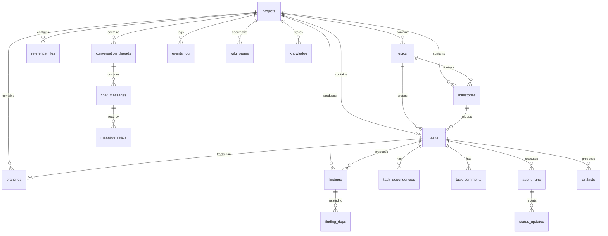
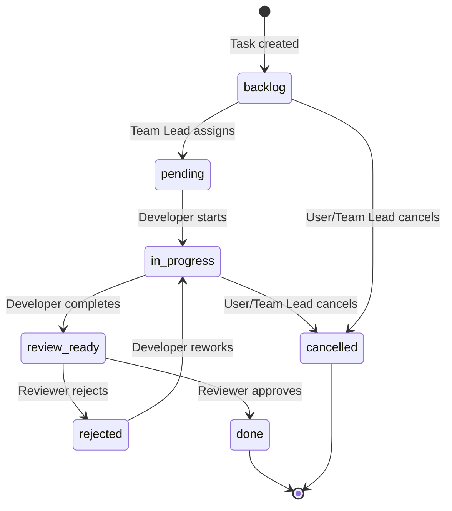
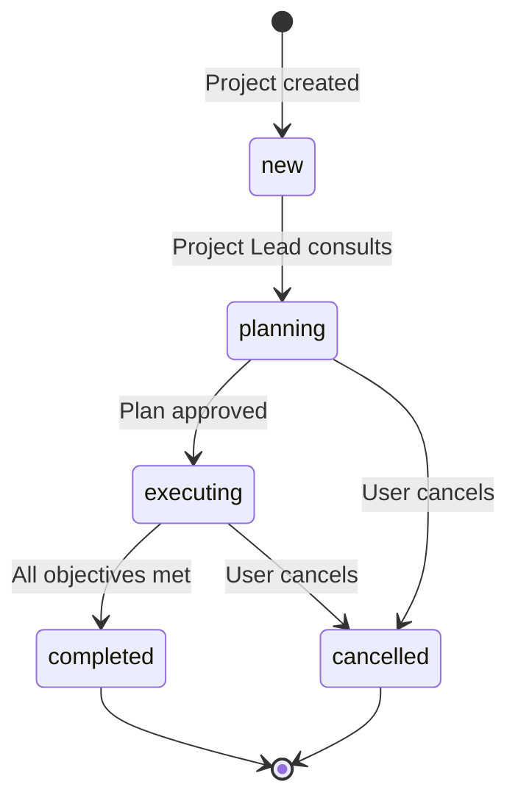
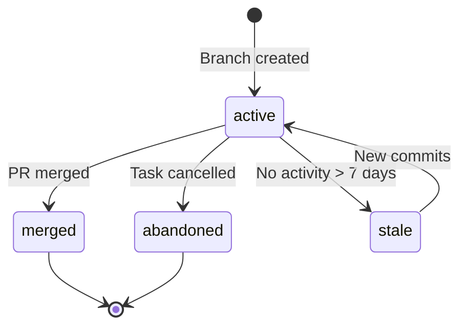

# Database Schema - PABADA v2

## 1. Introduction

This document describes the SQLite database schema for PABADA v2. The database serves as the **single source of truth** for all CrewAI flows and agents.

### Key Changes from v1 (old/)

| Aspect | v1 (old/) | v2 |
|--------|-----------|-----|
| Central concept | PRD-driven, single session | Project-centric, multi-project |
| Task states | 6 states (no review cycle) | 7 states with full review lifecycle |
| Dependencies | JSON arrays in `depends_on`/`blocks` | Normalized `task_dependencies` table |
| Git tracking | Only `code_reviews` table | Dedicated `branches` table + task link |
| Communication | Flat `chat_messages` | Threaded conversations with types |
| Audit | None | `events_log` with triggers |
| Search | FTS5 on findings/knowledge/wiki | FTS5 extended to tasks, comments, reference files |
| Reference files | Not tracked | `reference_files` table |
| Orchestration state | `session_phase` + `project_direction` | Replaced by project status + CrewAI Flow state |

### Design Principles

- **Normalized:** Dependencies, comments, and branches are separate tables (no JSON arrays for relationships).
- **Referential integrity:** All foreign keys use explicit `ON DELETE` policies (CASCADE, SET NULL).
- **Auditable:** Triggers automatically log entity lifecycle events to `events_log`.
- **Searchable:** FTS5 virtual tables with sync triggers for full-text search.
- **Performance:** Strategic indexes on columns used in WHERE, JOIN, and ORDER BY clauses.

---

## 2. Entity-Relationship Diagram



---

## 3. Core Tables

### projects

Root entity. Every project-scoped record links here via `project_id`.

| Column | Type | Constraints | Description |
|--------|------|-------------|-------------|
| id | INTEGER | PK AUTOINCREMENT | |
| name | TEXT | NOT NULL | Project name |
| description | TEXT | | Detailed description |
| status | TEXT | NOT NULL, CHECK | `new`, `planning`, `executing`, `completed`, `cancelled` |
| created_by | TEXT | DEFAULT 'user' | Creator identifier |
| created_at | DATETIME | DEFAULT CURRENT_TIMESTAMP | |
| completed_at | DATETIME | | Set when status becomes completed |
| metadata_json | TEXT | DEFAULT '{}' | Flexible config (framework, language, repo, etc.) |

### epics

High-level work grouping within a project.

| Column | Type | Constraints | Description |
|--------|------|-------------|-------------|
| id | INTEGER | PK AUTOINCREMENT | |
| project_id | INTEGER | NOT NULL, FK projects CASCADE | |
| title | TEXT | NOT NULL | |
| description | TEXT | | |
| status | TEXT | NOT NULL, CHECK | `open`, `in_progress`, `completed`, `cancelled` |
| priority | INTEGER | DEFAULT 2, CHECK 1-5 | 1 = highest |
| order_index | INTEGER | DEFAULT 0 | Manual ordering |
| created_by | TEXT | DEFAULT 'orchestrator' | |
| created_at | DATETIME | | |
| completed_at | DATETIME | | |

### milestones

Intermediate grouping within an epic. Provides project-level direct access via `project_id`.

| Column | Type | Constraints | Description |
|--------|------|-------------|-------------|
| id | INTEGER | PK AUTOINCREMENT | |
| project_id | INTEGER | NOT NULL, FK projects CASCADE | Direct project link for queries |
| epic_id | INTEGER | NOT NULL, FK epics CASCADE | |
| title | TEXT | NOT NULL | |
| description | TEXT | | |
| status | TEXT | NOT NULL, CHECK | `open`, `in_progress`, `completed`, `cancelled` |
| target_cycle | INTEGER | | Legacy cycle reference |
| due_date | DATETIME | | Target completion date |
| order_index | INTEGER | DEFAULT 0 | Manual ordering |
| created_at | DATETIME | | |
| completed_at | DATETIME | | |

### tasks

Core work unit. Supports 7 granular statuses and full review lifecycle.

| Column | Type | Constraints | Description |
|--------|------|-------------|-------------|
| id | INTEGER | PK AUTOINCREMENT | |
| project_id | INTEGER | NOT NULL, FK projects CASCADE | |
| epic_id | INTEGER | FK epics SET NULL | |
| milestone_id | INTEGER | FK milestones SET NULL | |
| parent_task_id | INTEGER | FK tasks SET NULL | Sub-task support |
| type | TEXT | NOT NULL, CHECK | `plan`, `research`, `code`, `review`, `test`, `design`, `integrate`, `documentation`, `bug_fix` |
| status | TEXT | NOT NULL, DEFAULT 'backlog', CHECK | `backlog`, `pending`, `in_progress`, `review_ready`, `rejected`, `done`, `cancelled` |
| title | TEXT | NOT NULL | |
| description | TEXT | | |
| acceptance_criteria | TEXT | | What "done" looks like |
| context_json | TEXT | | Additional context for the agent |
| priority | INTEGER | DEFAULT 2, CHECK 1-5 | 1 = highest |
| estimated_complexity | TEXT | DEFAULT 'medium', CHECK | `trivial`, `low`, `medium`, `high`, `very_high` |
| branch_name | TEXT | | Git branch name (e.g. `task-42-login`) |
| assigned_to | TEXT | | Agent ID assigned to this task |
| reviewer | TEXT | | Agent ID responsible for review |
| created_by | TEXT | NOT NULL, DEFAULT 'orchestrator' | |
| retry_count | INTEGER | DEFAULT 0 | Number of retries after failure |
| created_at | DATETIME | | |
| completed_at | DATETIME | | |

### task_dependencies

Normalized dependency graph between tasks. Replaces the old JSON `depends_on`/`blocks` columns.

| Column | Type | Constraints | Description |
|--------|------|-------------|-------------|
| id | INTEGER | PK AUTOINCREMENT | |
| task_id | INTEGER | NOT NULL, FK tasks CASCADE | The task that depends |
| depends_on_task_id | INTEGER | NOT NULL, FK tasks CASCADE | The task depended upon |
| dependency_type | TEXT | DEFAULT 'blocks', CHECK | `blocks`, `related_to`, `parent_of` |
| created_at | DATETIME | | |
| | | UNIQUE(task_id, depends_on_task_id) | Prevent duplicates |

### task_comments

Structured communication on tickets. Used by developers, reviewers, and team leads.

| Column | Type | Constraints | Description |
|--------|------|-------------|-------------|
| id | INTEGER | PK AUTOINCREMENT | |
| task_id | INTEGER | NOT NULL, FK tasks CASCADE | |
| author | TEXT | NOT NULL | Agent or user ID |
| comment_type | TEXT | DEFAULT 'comment', CHECK | `comment`, `change_request`, `approval`, `question`, `answer` |
| content | TEXT | NOT NULL | |
| metadata_json | TEXT | DEFAULT '{}' | Code snippets, line refs, etc. |
| created_at | DATETIME | | |

---

## 4. Git Integration

### branches

Tracks Git branches associated with tasks and projects.

| Column | Type | Constraints | Description |
|--------|------|-------------|-------------|
| id | INTEGER | PK AUTOINCREMENT | |
| project_id | INTEGER | NOT NULL, FK projects CASCADE | |
| task_id | INTEGER | FK tasks SET NULL | NULL for manual branches |
| repo_name | TEXT | NOT NULL | Repository identifier |
| branch_name | TEXT | NOT NULL | |
| base_branch | TEXT | DEFAULT 'main' | |
| status | TEXT | DEFAULT 'active', CHECK | `active`, `merged`, `abandoned`, `stale` |
| created_by | TEXT | NOT NULL | |
| created_at | DATETIME | | |
| merged_at | DATETIME | | |
| last_commit_hash | TEXT | | Short SHA |
| last_commit_at | DATETIME | | |
| | | UNIQUE(repo_name, branch_name) | |

---

## 5. Communication

### conversation_threads

Metadata for conversation threads. Links to project and optionally to a task.

| Column | Type | Constraints | Description |
|--------|------|-------------|-------------|
| id | INTEGER | PK AUTOINCREMENT | |
| thread_id | TEXT | UNIQUE NOT NULL | External thread identifier |
| project_id | INTEGER | FK projects CASCADE | |
| task_id | INTEGER | FK tasks SET NULL | |
| thread_type | TEXT | NOT NULL, CHECK | `task_discussion`, `code_review`, `brainstorming`, `user_chat`, `team_sync` |
| participants_json | TEXT | DEFAULT '[]' | List of agent IDs |
| status | TEXT | DEFAULT 'active', CHECK | `active`, `archived`, `resolved` |
| created_at | DATETIME | | |
| last_message_at | DATETIME | | |

### chat_messages

Individual messages within threads. Supports threading via `parent_message_id`.

| Column | Type | Constraints | Description |
|--------|------|-------------|-------------|
| id | INTEGER | PK AUTOINCREMENT | |
| project_id | INTEGER | FK projects CASCADE | |
| thread_id | TEXT | NOT NULL, FK conversation_threads(thread_id) CASCADE | Every message must belong to a thread |
| parent_message_id | INTEGER | FK chat_messages SET NULL | Reply threading |
| from_agent | TEXT | NOT NULL | Sender |
| to_agent | TEXT | | Direct recipient |
| to_role | TEXT | | Role-based recipient |
| conversation_type | TEXT | DEFAULT 'agent_to_agent', CHECK | `agent_to_agent`, `user_to_agent`, `agent_to_user`, `broadcast` |
| message | TEXT | NOT NULL | |
| priority | INTEGER | DEFAULT 0 | |
| metadata_json | TEXT | DEFAULT '{}' | |
| created_at | DATETIME | | |

### message_reads

Tracks which agents have read which messages.

| Column | Type | Constraints | Description |
|--------|------|-------------|-------------|
| id | INTEGER | PK AUTOINCREMENT | |
| message_id | INTEGER | NOT NULL, FK chat_messages CASCADE | |
| agent_id | TEXT | NOT NULL | |
| read_at | DATETIME | | |
| | | UNIQUE(message_id, agent_id) | |

---

## 6. State Transitions

### Task Status



| Status | Description | Who Triggers | Next States |
|--------|-------------|-------------|-------------|
| `backlog` | Created, awaiting assignment | Task creation | `pending`, `cancelled` |
| `pending` | Assigned, awaiting start | Team Lead | `in_progress` |
| `in_progress` | Active development/research | Agent picks up | `review_ready`, `cancelled` |
| `review_ready` | Implementation done, awaiting review | Developer/Researcher | `done`, `rejected` |
| `rejected` | Changes requested by reviewer | Code/Research Reviewer | `in_progress` |
| `done` | Completed and approved | Reviewer | (terminal) |
| `cancelled` | No longer needed | User/Team Lead | (terminal) |

### Project Status



### Branch Status



---

## 7. Task Dependencies

Dependencies are modeled as a directed acyclic graph (DAG) in the `task_dependencies` table.

**Dependency types:**

| Type | Meaning | Example |
|------|---------|---------|
| `blocks` | Task B cannot start until Task A is done | Auth middleware blocks protected routes |
| `related_to` | Informational link, no blocking | Two tasks touching the same module |
| `parent_of` | Hierarchical sub-task relationship | Epic task → implementation sub-tasks |

**Finding blocked tasks:**

```sql
-- Tasks blocked by incomplete dependencies
SELECT t.*
FROM tasks t
JOIN task_dependencies td ON td.task_id = t.id
JOIN tasks dep ON dep.id = td.depends_on_task_id
WHERE t.project_id = ?
  AND t.status IN ('backlog', 'pending')
  AND td.dependency_type = 'blocks'
  AND dep.status NOT IN ('done', 'cancelled')
GROUP BY t.id;
```

**Finding ready tasks (no blockers):**

```sql
-- Tasks with all blocking dependencies resolved
SELECT t.*
FROM tasks t
WHERE t.project_id = ?
  AND t.status IN ('backlog', 'pending')
  AND t.id NOT IN (
      SELECT td.task_id
      FROM task_dependencies td
      JOIN tasks dep ON dep.id = td.depends_on_task_id
      WHERE td.dependency_type = 'blocks'
        AND dep.status NOT IN ('done', 'cancelled')
  )
ORDER BY t.priority ASC, t.id ASC;
```

---

## 8. Audit and Events

The `events_log` table records system events via database triggers and application-level inserts.

### Automatically Logged Events (Triggers)

| Event Type | Trigger | Data Captured |
|------------|---------|---------------|
| `task_created` | AFTER INSERT on tasks | title, type, status, assigned_to |
| `task_status_changed` | AFTER UPDATE of status on tasks | old_status, new_status, assigned_to |
| `task_updated` | AFTER UPDATE on tasks (non-status) | title, assigned_to, reviewer, branch_name |
| `epic_created` | AFTER INSERT on epics | title, status |
| `epic_status_changed` | AFTER UPDATE of status on epics | old_status, new_status |
| `milestone_created` | AFTER INSERT on milestones | title, status |
| `milestone_status_changed` | AFTER UPDATE of status on milestones | old_status, new_status |

### Application-Level Events

These should be emitted by flows/tools:

| Event Type | When | Source |
|------------|------|--------|
| `project_created` | New project created | API/Flow |
| `review_requested` | Task moves to review_ready | DevelopmentFlow |
| `review_approved` | Code reviewer approves | CodeReviewFlow |
| `review_rejected` | Code reviewer rejects | CodeReviewFlow |
| `research_completed` | Research task approved | ResearchFlow |
| `stagnation_detected` | No progress detected | StagnationDetectedListener |
| `brainstorm_started` | Brainstorming session begins | BrainstormingFlow |
| `user_message_received` | User sends a message | API |

### Querying Events

```sql
-- Project timeline
SELECT * FROM events_log
WHERE project_id = ?
ORDER BY created_at DESC
LIMIT 50;

-- Events for a specific task
SELECT * FROM events_log
WHERE entity_type = 'task' AND entity_id = ?
ORDER BY created_at ASC;
```

---

## 9. Full-Text Search (FTS5)

### Available FTS Tables

| FTS Table | Source Table | Indexed Columns |
|-----------|-------------|-----------------|
| `findings_fts` | findings | topic, content |
| `knowledge_fts` | knowledge | category, key, value |
| `wiki_fts` | wiki_pages | path, title, content |
| `tasks_fts` | tasks | title, description, acceptance_criteria |
| `task_comments_fts` | task_comments | content |
| `reference_files_fts` | reference_files | file_name, description |

All FTS tables use content-sync triggers (AFTER INSERT, UPDATE, DELETE) to stay in sync with source tables.

### Usage Examples

```sql
-- Search tasks by keyword
SELECT t.*
FROM tasks t
JOIN tasks_fts ON tasks_fts.rowid = t.id
WHERE tasks_fts MATCH 'authentication OR JWT'
ORDER BY rank;

-- Search findings with confidence filter
SELECT f.*
FROM findings f
JOIN findings_fts ON findings_fts.rowid = f.id
WHERE findings_fts MATCH 'attention mechanism'
  AND f.confidence >= 0.7
ORDER BY f.confidence DESC;

-- Search across task comments
SELECT tc.*, t.title AS task_title
FROM task_comments tc
JOIN task_comments_fts ON task_comments_fts.rowid = tc.id
JOIN tasks t ON t.id = tc.task_id
WHERE task_comments_fts MATCH 'rate limiting'
ORDER BY rank;
```

---

## 10. Common Queries

### Project progress metrics

```sql
SELECT
    p.id,
    p.name,
    COUNT(t.id) AS total_tasks,
    SUM(CASE WHEN t.status = 'done' THEN 1 ELSE 0 END) AS done_tasks,
    SUM(CASE WHEN t.status = 'in_progress' THEN 1 ELSE 0 END) AS active_tasks,
    SUM(CASE WHEN t.status IN ('backlog', 'pending') THEN 1 ELSE 0 END) AS pending_tasks,
    ROUND(100.0 * SUM(CASE WHEN t.status = 'done' THEN 1 ELSE 0 END) / COUNT(t.id), 1) AS pct_complete
FROM projects p
LEFT JOIN tasks t ON t.project_id = p.id
WHERE p.id = ?
GROUP BY p.id;
```

### Tasks assigned to a specific agent

```sql
SELECT t.*, e.title AS epic_title, m.title AS milestone_title
FROM tasks t
LEFT JOIN epics e ON e.id = t.epic_id
LEFT JOIN milestones m ON m.id = t.milestone_id
WHERE t.assigned_to = ?
  AND t.status NOT IN ('done', 'cancelled')
ORDER BY t.priority ASC, t.created_at ASC;
```

### Active branches for a project

```sql
SELECT b.*, t.title AS task_title
FROM branches b
LEFT JOIN tasks t ON t.id = b.task_id
WHERE b.project_id = ?
  AND b.status = 'active'
ORDER BY b.last_commit_at DESC;
```

### Full conversation thread

```sql
SELECT cm.*
FROM chat_messages cm
WHERE cm.thread_id = ?
ORDER BY cm.created_at ASC;
```

### Unread messages for an agent

```sql
SELECT cm.*
FROM chat_messages cm
WHERE (cm.to_agent = ? OR cm.to_role = ?)
  AND cm.id NOT IN (
      SELECT mr.message_id FROM message_reads mr WHERE mr.agent_id = ?
  )
ORDER BY cm.created_at ASC;
```

### Findings by confidence

```sql
SELECT f.*, t.title AS task_title
FROM findings f
JOIN tasks t ON t.id = f.task_id
WHERE f.project_id = ?
  AND f.confidence >= ?
ORDER BY f.confidence DESC;
```

---

## 11. Referential Integrity Policies

| Parent | Child | ON DELETE | Rationale |
|--------|-------|-----------|-----------|
| projects | epics, milestones, tasks, branches, etc. | CASCADE | Deleting a project removes all its data |
| epics | milestones | CASCADE | Epic owns its milestones |
| epics | tasks.epic_id | SET NULL | Tasks can exist without an epic |
| milestones | tasks.milestone_id | SET NULL | Tasks can exist without a milestone |
| tasks | task_dependencies | CASCADE | Removing a task cleans dependencies |
| tasks | task_comments | CASCADE | Comments belong to the task |
| tasks | branches.task_id | SET NULL | Branch can outlive a task |
| tasks | findings | CASCADE | Findings belong to the task |
| tasks | agent_runs | CASCADE | Runs belong to the task |
| chat_messages | message_reads | CASCADE | Reads belong to the message |
| chat_messages | chat_messages.parent_message_id | SET NULL | Preserve thread on parent delete |

---

## 12. Migration Strategy

### Directory Structure

```
backend/db/
  schema.sql              -- Full schema (for fresh installs)
  migrations/
    001_initial_v2.sql    -- Future: first migration
    002_add_column.sql    -- Future: incremental changes
  seeds/
    dev_data.sql          -- Sample data for development
```

### Migration Table

```sql
CREATE TABLE schema_migrations (
    version    INTEGER PRIMARY KEY,
    name       TEXT NOT NULL,
    applied_at DATETIME DEFAULT CURRENT_TIMESTAMP
);
```

### Rules

1. Migrations are numbered sequentially: `001_`, `002_`, etc.
2. Each migration must be **idempotent** (use `IF NOT EXISTS`, `IF EXISTS`).
3. Migration scripts should include rollback comments when feasible.
4. The `schema_migrations` table tracks which migrations have been applied.
5. For fresh installs, `schema.sql` creates everything from scratch.

---

## 13. Performance Considerations

### Index Strategy

- **Single-column indexes** on all foreign keys and status/type columns used in WHERE clauses.
- **Composite index** `(entity_type, entity_id)` on `events_log` for entity-specific event queries.
- **Descending index** on `tasks.priority` for priority-ordered queries.
- FTS5 tables provide fast full-text search without additional indexes.

### Query Patterns to Optimize

| Pattern | Optimization |
|---------|-------------|
| "Next task to assign" | Index on `(project_id, status)` + dependency subquery |
| "Project progress" | COUNT with GROUP BY on indexed status column |
| "Unread messages" | LEFT JOIN on message_reads with indexed agent_id |
| "Event timeline" | Index on `created_at` for time-range queries |

### WAL Mode

The schema uses `PRAGMA journal_mode = WAL` for better concurrent read performance. This is important for the multi-agent architecture where multiple flows may read simultaneously while one writes.

### Connection Settings

```sql
PRAGMA foreign_keys = ON;     -- Enforce referential integrity
PRAGMA journal_mode = WAL;    -- Write-ahead logging for concurrency
PRAGMA busy_timeout = 5000;   -- Wait up to 5s on locks
PRAGMA synchronous = NORMAL;  -- Balance safety vs speed
PRAGMA cache_size = -8000;    -- 8MB page cache
```
