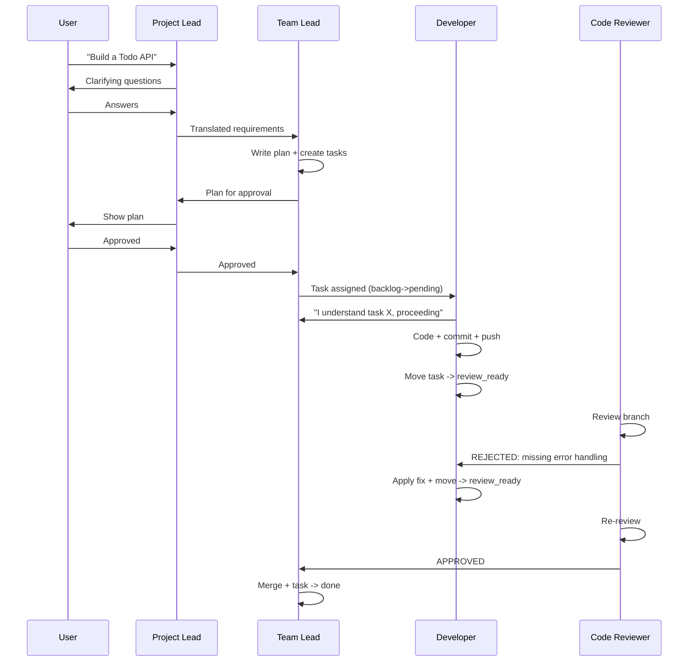
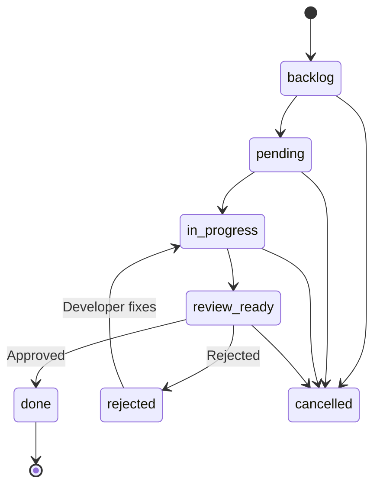

# Example: Simple Todo API Project

This document walks through a complete project lifecycle in PABADA, from initial user request to project completion.

## Project Overview

- **Project:** Simple Todo API
- **Epics:** Backend API, Frontend UI
- **Milestones:** MVP (under Backend API), v1.0 (under Frontend UI)
- **Task Types:** `code`, `research`
- **Agents:** Project Lead, Team Lead, Developer, Code Reviewer

---

## 1. Project Creation

The user creates a project via the API or UI:

```bash
curl -X POST http://localhost:8000/api/projects \
  -H "Content-Type: application/json" \
  -d '{"name": "Simple Todo API", "description": "A REST API for managing todo items"}'
```

Response:
```json
{
  "id": 1,
  "name": "Simple Todo API",
  "status": "new",
  "total_tasks": 0,
  "total_epics": 0
}
```

## 2. Planning Phase

### Epics

```bash
# Backend API epic
curl -X POST http://localhost:8000/api/epics \
  -d '{"project_id": 1, "title": "Backend API", "description": "REST API with CRUD endpoints"}'

# Frontend UI epic
curl -X POST http://localhost:8000/api/epics \
  -d '{"project_id": 1, "title": "Frontend UI", "description": "React-based todo interface"}'
```

### Tasks with Dependencies

```bash
# Research task (no dependencies)
curl -X POST http://localhost:8000/api/tasks \
  -d '{
    "project_id": 1,
    "title": "Research database options",
    "type": "research",
    "epic_id": 1,
    "priority": 1
  }'
# Returns task_id: 1

# Code task depending on research
curl -X POST http://localhost:8000/api/tasks \
  -d '{
    "project_id": 1,
    "title": "Implement Todo model",
    "type": "code",
    "epic_id": 1,
    "priority": 2,
    "depends_on": [1]
  }'
# Returns task_id: 2

# Another code task depending on the model
curl -X POST http://localhost:8000/api/tasks \
  -d '{
    "project_id": 1,
    "title": "Build CRUD endpoints",
    "type": "code",
    "epic_id": 1,
    "depends_on": [2]
  }'
# Returns task_id: 3
```

## 3. Development Phase

### Task Lifecycle

Each task follows the state machine:

```
backlog -> pending -> in_progress -> review_ready -> done
                                  -> rejected -> in_progress (retry)
```

The Developer agent picks up a task:

1. **TakeTaskTool** transitions `pending` -> `in_progress` and assigns the agent
2. Developer writes code, commits, pushes to a feature branch
3. **UpdateTaskStatusTool** transitions to `review_ready`

### Agent Interactions

The agents communicate through the messaging system:

```
Developer -> Team Lead: "Task #2 is ready for review. Branch: feature/todo-model"
Team Lead -> Code Reviewer: "Please review feature/todo-model for task #2"
Code Reviewer -> Developer: "REJECTED: Missing input validation on title field"
Developer -> Code Reviewer: "Fixed. Please re-review."
Code Reviewer -> Team Lead: "APPROVED: Code looks good now."
Team Lead -> Developer: "Merged. Moving to next task."
```

## 4. Code Review Flow

### Approval Path

```
review_ready -> Code Reviewer reviews -> APPROVED -> done
```

### Rejection and Retry Path

```
review_ready -> Code Reviewer reviews -> REJECTED -> rejected (retry_count += 1)
rejected -> in_progress (developer fixes) -> review_ready -> APPROVED -> done
```

## 5. Dependency Management

Tasks cannot start until their blocking dependencies are complete:

```
Task #1 (Research DB) ──[blocks]──> Task #2 (Todo model)
Task #2 (Todo model)  ──[blocks]──> Task #3 (CRUD endpoints)
```

The `DependencyValidator` enforces this:
- `can_start(task_id=2)` returns `False` while Task #1 is not `done`
- `can_start(task_id=2)` returns `True` once Task #1 reaches `done`

## 6. Brainstorming Sessions

When the team gets stuck or needs creative input, trigger a brainstorming session:

```bash
curl -X POST http://localhost:8000/api/projects/1/start
```

The brainstorming flow follows three phases:
1. **Brainstorm** — agents generate ideas freely
2. **Converge** — ideas are grouped and ranked
3. **Decide** — top ideas become new tasks

## 7. Completion Detection

The `CompletionDetector` monitors project state:

| State | Condition |
|-------|-----------|
| `ACTIVE` | Dev tasks are `in_progress` |
| `WAITING_FOR_RESEARCH` | Only research tasks are `in_progress` |
| `IDLE_OBJECTIVES_PENDING` | No tasks in progress, but epics remain open |
| `IDLE_OBJECTIVES_MET` | No tasks in progress, all epics completed |

When idle, the system notifies the user with actionable suggestions.

## 8. Event Flow Diagram

### Full Lifecycle



### Rejection Retry Cycle



## 9. Running the Integration Tests

The test suite at `backend/tests/integration/test_full_lifecycle.py` exercises these exact lifecycle paths using the real tool layer:

```bash
pytest backend/tests/integration/test_full_lifecycle.py -v
```

Test cases:
- `test_development_lifecycle` — full backlog-to-done for code tasks
- `test_research_lifecycle` — research task with findings and validation
- `test_rejection_and_retry` — rejection, retry, and eventual approval
- `test_dependency_blocks_task` — dependency enforcement
- `test_communication_during_lifecycle` — inter-agent messaging
- `test_all_tasks_done_triggers_completion` — completion detection
