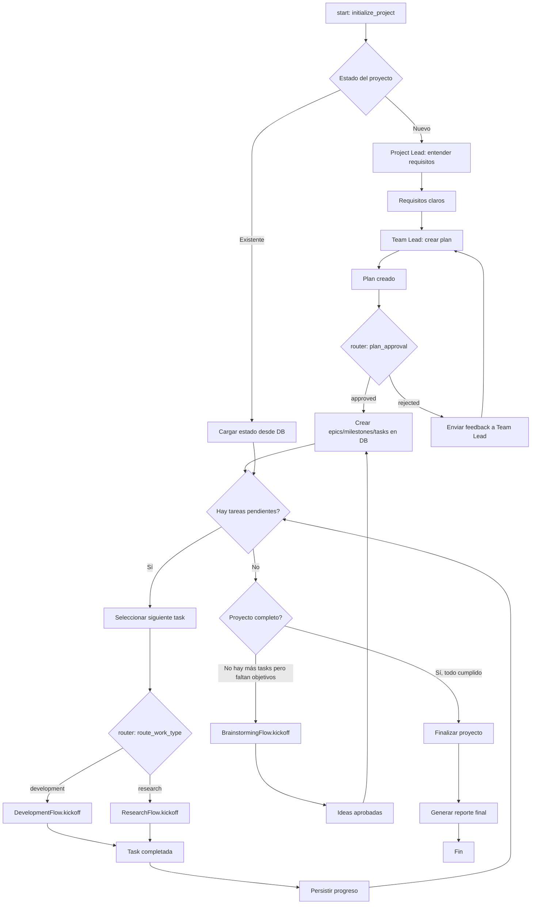
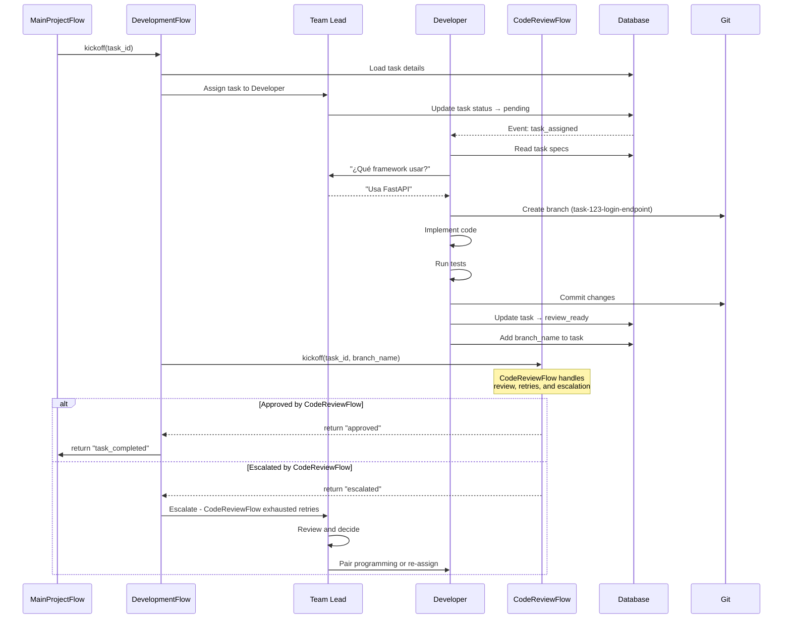
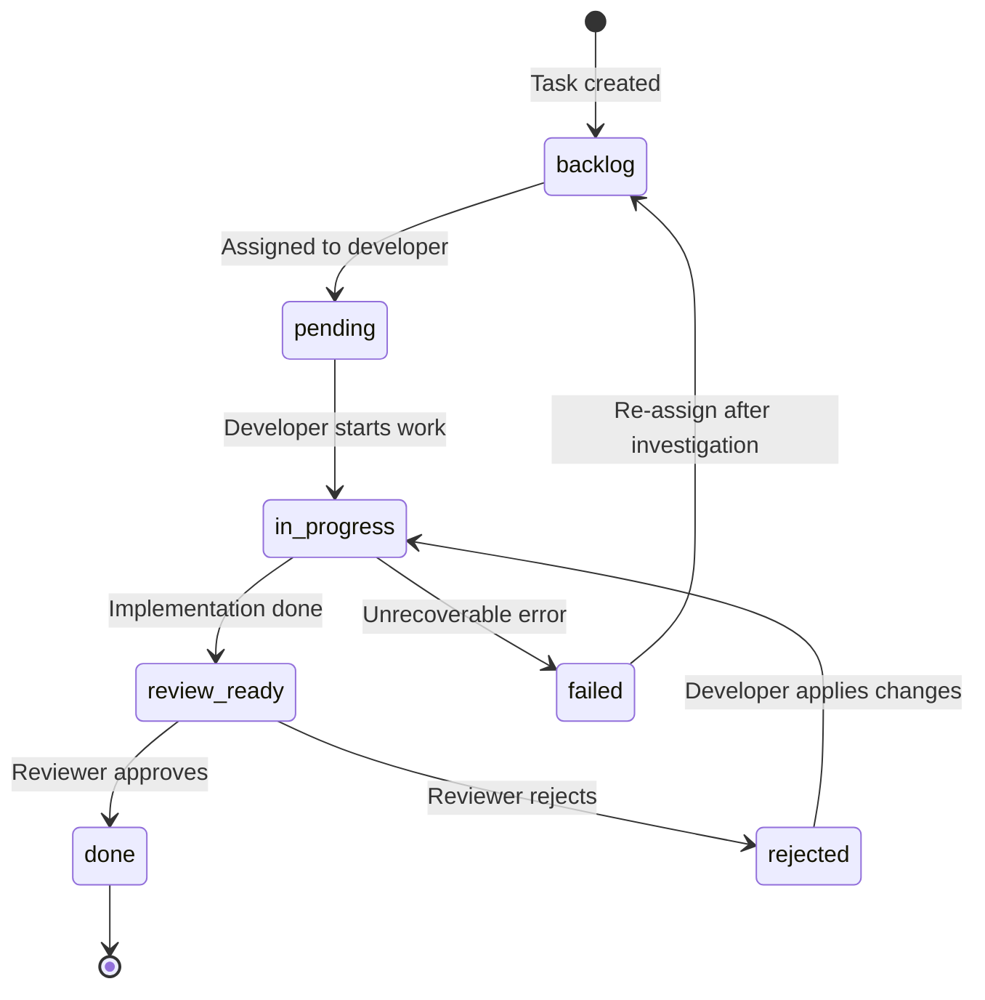
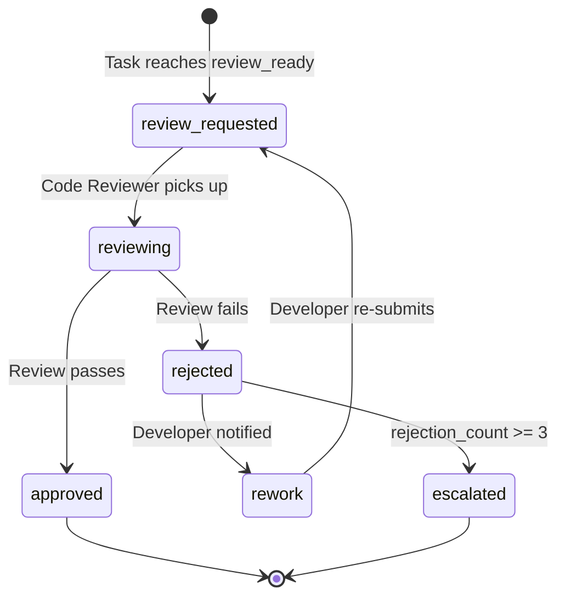
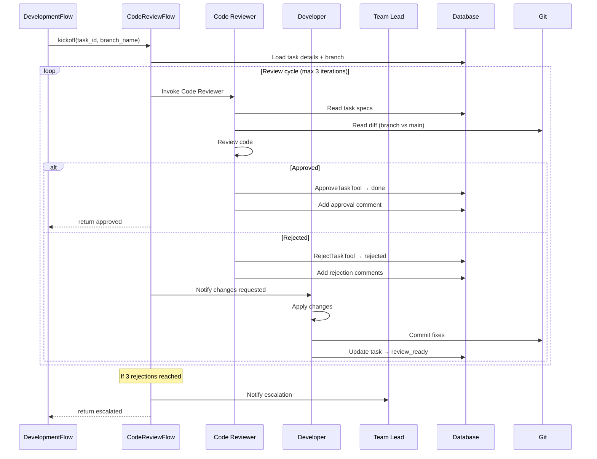
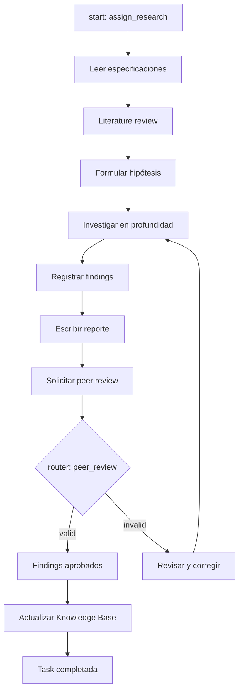
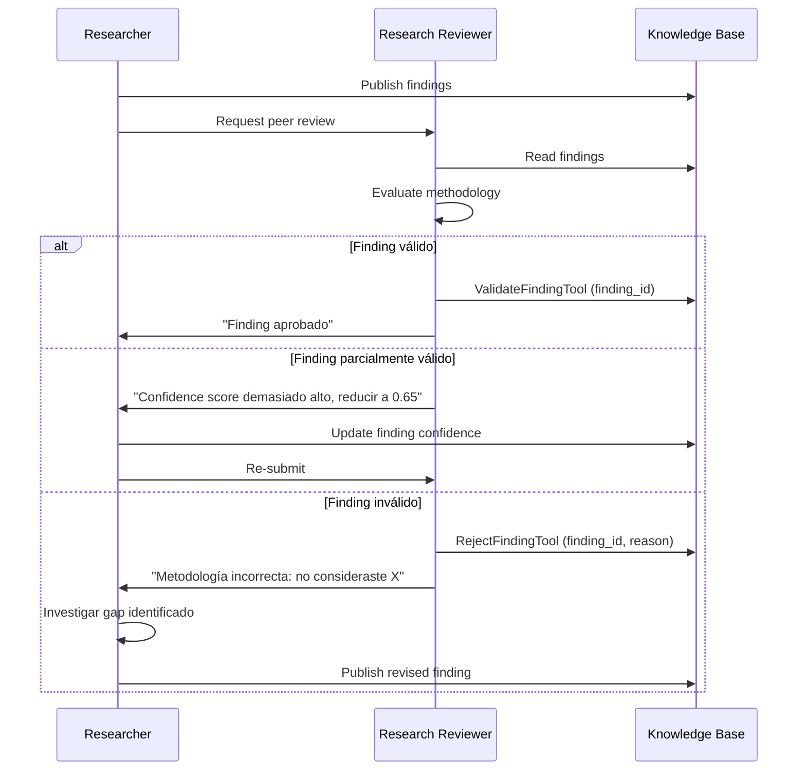
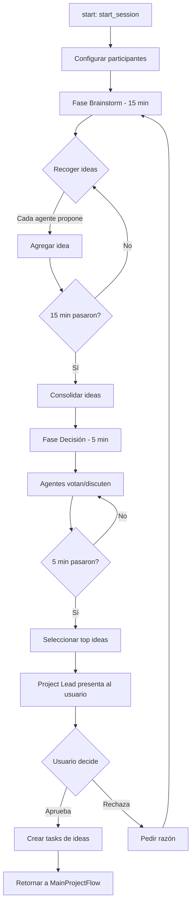
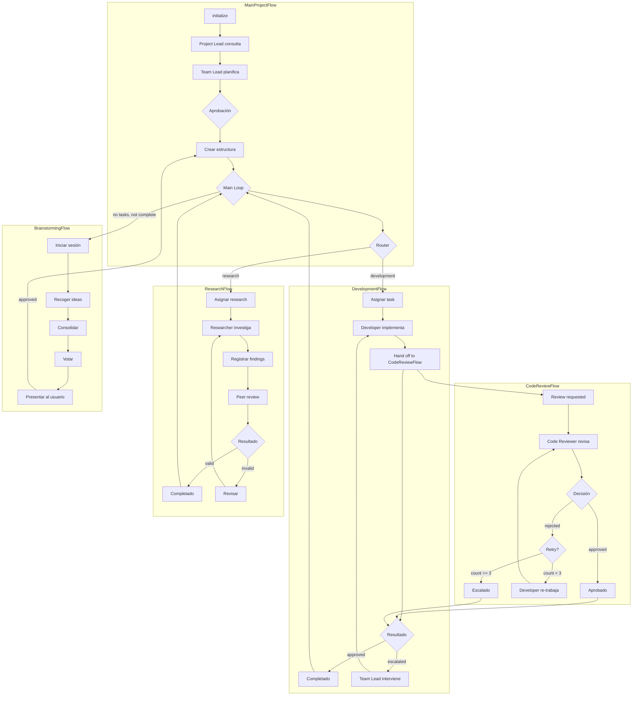
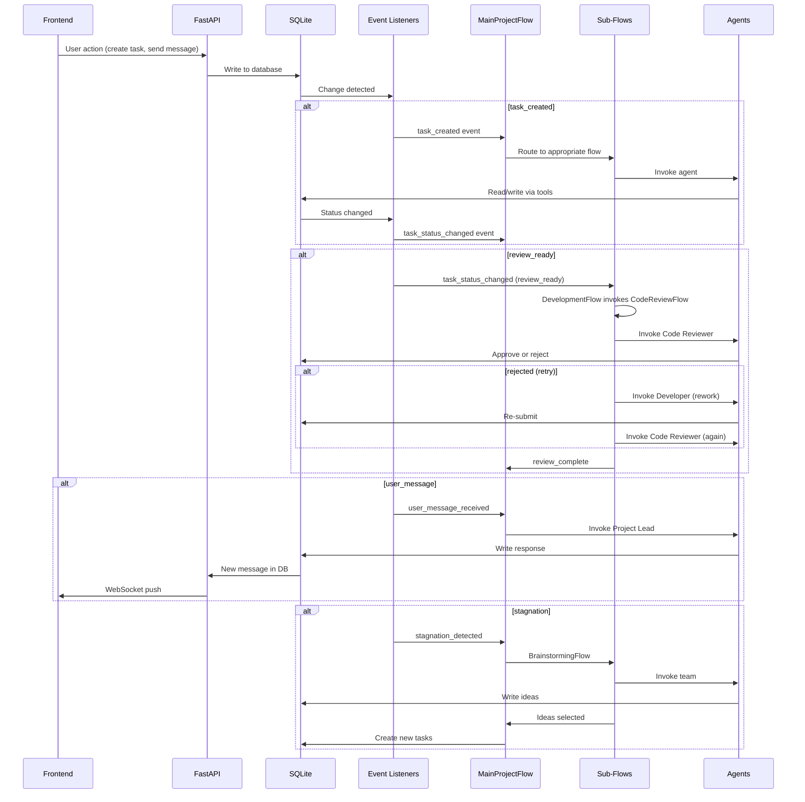

# Flows Design - PABADA v2

> **Implementation Status:** All flows described in this document have been implemented.
> See `backend/flows/` for the code. Usage guide: `docs/flows-usage.md`.
> Event system reference: `docs/event-system.md`.

## 1. Principios de Diseño de Flows

### Determinismo donde sea posible

Los flows definen el **proceso** — el orden en que las cosas suceden, qué condiciones se evalúan, y qué caminos se toman. Esto es predecible, debuggeable, y reproducible.

```
@start() → @listen() → @router() → @listen() → ...
```

Cada paso en el flow tiene:
- Input bien definido (estado anterior)
- Output bien definido (estado nuevo o evento emitido)
- Lógica de routing explícita (no basada en LLM)

### Inteligencia donde sea necesario

Los **agentes** se invocan dentro de los flows para decisiones que requieren razonamiento:
- Entender requisitos del usuario (Project Lead)
- Crear un plan de trabajo (Team Lead)
- Implementar código (Developer)
- Revisar código (Code Reviewer)
- Investigar un tema (Researcher)

El flow decide **cuándo** invocar un agente. El agente decide **cómo** resolver el problema.

### Event-driven por defecto

Todas las transiciones entre estados se basan en eventos:
- `@listen("event_name")` reacciona a eventos
- `@router("event_name")` decide entre múltiples caminos
- Event listeners detectan cambios en DB y emiten eventos

No hay polling. No hay sleep loops. No hay timers manuales.

---

## 2. MainProjectFlow Detallado

### Diagrama de Estados Completo



### Pseudocódigo

```python
from crewai.flow.flow import Flow, start, listen, router

class MainProjectFlow(Flow[ProjectState]):

    @start()
    def initialize_project(self):
        """Load or create project."""
        if self.state.project_id:
            # Existing project — load state from DB
            self.state = load_project_state(self.state.project_id)
            if self.state.status == ProjectStatus.EXECUTING:
                return "resume_execution"
            return "project_loaded"
        else:
            # New project
            self.state.project_id = create_project_in_db()
            self.state.status = ProjectStatus.NEW
            return "new_project"

    @listen("new_project")
    def consult_project_lead(self):
        """Invoke Project Lead to understand requirements."""
        crew = Crew(
            agents=[project_lead_agent],
            tasks=[
                Task(
                    description="Understand user requirements for this project",
                    agent=project_lead_agent,
                    expected_output="Clear requirements document"
                )
            ]
        )
        result = crew.kickoff()
        self.state.requirements = result.raw
        return "requirements_ready"

    @listen("requirements_ready")
    def create_plan(self):
        """Invoke Team Lead to create a detailed plan."""
        crew = Crew(
            agents=[team_lead_agent],
            tasks=[
                Task(
                    description=f"Create detailed plan based on: {self.state.requirements}",
                    agent=team_lead_agent,
                    expected_output="Detailed plan with epics, milestones, tasks"
                )
            ]
        )
        result = crew.kickoff()
        self.state.plan = result.raw
        return "plan_created"

    @router("plan_created")
    def plan_approval_router(self):
        """Route based on user approval of the plan."""
        # Project Lead presents plan to user and gets approval
        crew = Crew(
            agents=[project_lead_agent],
            tasks=[
                Task(
                    description=f"Present this plan to user and get approval: {self.state.plan}",
                    agent=project_lead_agent,
                    expected_output="approved or rejected with feedback"
                )
            ]
        )
        result = crew.kickoff()

        if "approved" in result.raw.lower():
            self.state.user_approved = True
            return "approved"
        else:
            self.state.feedback = result.raw
            return "rejected"

    @listen("rejected")
    def handle_rejection(self):
        """Pass feedback back to Team Lead for plan revision."""
        self.state.plan = None
        self.state.user_approved = False
        return "requirements_ready"  # loops back to create_plan

    @listen("approved")
    def create_structure(self):
        """Create epics, milestones, and tasks in DB."""
        # Team Lead creates structure based on approved plan
        crew = Crew(
            agents=[team_lead_agent],
            tasks=[
                Task(
                    description=f"Create epics, milestones, and tasks for: {self.state.plan}",
                    agent=team_lead_agent,
                    expected_output="Structure created in database"
                )
            ]
        )
        crew.kickoff()
        self.state.status = ProjectStatus.EXECUTING
        return "structure_created"

    def _check_pending_tasks(self):
        """Shared handler: check if there are pending tasks to work on."""
        pending = get_pending_tasks(self.state.project_id)
        if pending:
            self.state.current_task = pending[0]
            return "has_pending_tasks"
        return "no_pending_tasks"

    @listen("structure_created")
    def check_pending_after_structure(self):
        return self._check_pending_tasks()

    @listen("resume_execution")
    def check_pending_after_resume(self):
        return self._check_pending_tasks()

    @listen("task_completed")
    def check_pending_after_task(self):
        return self._check_pending_tasks()

    @router("has_pending_tasks")
    def route_work_type(self):
        """Route to appropriate sub-flow based on task type."""
        task = self.state.current_task
        if task["type"] == "development":
            return "development"
        elif task["type"] == "research":
            return "research"

    @listen("development")
    def run_development_flow(self):
        """Execute DevelopmentFlow for the current task."""
        dev_flow = DevelopmentFlow()
        dev_flow.state.task_id = self.state.current_task["id"]
        dev_flow.kickoff()
        return "task_completed"

    @listen("research")
    def run_research_flow(self):
        """Execute ResearchFlow for the current task."""
        research_flow = ResearchFlow()
        research_flow.state.task_id = self.state.current_task["id"]
        research_flow.kickoff()
        return "task_completed"

    @router("no_pending_tasks")
    def completion_router(self):
        """Check if project objectives are met."""
        if all_objectives_met(self.state.project_id):
            return "project_complete"
        return "not_complete"

    @listen("not_complete")
    def trigger_brainstorming(self):
        """Start brainstorming session to generate new tasks."""
        brainstorm_flow = BrainstormingFlow()
        brainstorm_flow.kickoff()
        new_ideas = brainstorm_flow.state.selected_ideas
        self.state.new_ideas = new_ideas
        return "approved"  # goes to create_structure

    @listen("project_complete")
    def finalize(self):
        """Generate final report and mark project as completed."""
        self.state.status = ProjectStatus.COMPLETED
        generate_final_report(self.state.project_id)
        return "done"
```

### Manejo de Errores y Edge Cases

| Caso | Manejo |
|------|--------|
| Project Lead no entiende al usuario | Hace hasta 5 preguntas de clarificación antes de escalar |
| Team Lead crea plan inviable | User rechaza via Project Lead, Team Lead recibe feedback |
| Todas las tasks fallan | StagnationDetectedListener triggerea brainstorming |
| Usuario no responde | Timeout de 24h, luego pausa proyecto |
| DB no disponible | Circuit breaker con retry exponencial |
| Sub-flow falla | Catch exception, log error, continuar con siguiente task |

### Ejemplo de Ejecución Completa

```
1. MainProjectFlow.initialize_project()
   → Estado: NEW, project_id: "abc123"

2. consult_project_lead()
   → Project Lead: "¿Qué tipo de sistema necesitas?"
   → Usuario: "Un API REST para gestión de inventario"
   → Project Lead: "¿Qué entidades? ¿Autenticación?"
   → Usuario: "Productos, categorías, usuarios. JWT auth."
   → Requirements: {entities: [products, categories, users], auth: "JWT"}

3. create_plan()
   → Team Lead crea:
     Epic 1: "Sistema de Autenticación"
       Milestone 1.1: "JWT Auth"
         Task 1.1.1: "Implementar login endpoint" (development)
         Task 1.1.2: "Implementar middleware de auth" (development)
     Epic 2: "API de Inventario"
       Milestone 2.1: "CRUD Productos"
         Task 2.1.1: "Research mejores prácticas REST" (research)
         Task 2.1.2: "Implementar CRUD productos" (development)

4. plan_approval_router()
   → Project Lead presenta plan al usuario
   → Usuario: "Aprobado"
   → return "approved"

5. create_structure()
   → Epics, milestones, tasks creados en DB

6. check_pending_tasks()
   → Task 1.1.1 es la primera pending
   → return "has_pending_tasks"

7. route_work_type()
   → Task 1.1.1 type="development"
   → return "development"

8. run_development_flow()
   → DevelopmentFlow se ejecuta para Task 1.1.1
   → Developer crea branch, implementa, commitea
   → Code Reviewer aprueba
   → return "task_completed"

9. check_pending_tasks()
   → Task 1.1.2 es la siguiente
   → ... (cycle continues)

10. Eventually: no_pending_tasks
    → completion_router(): all objectives met
    → finalize(): generate report, mark completed
```

---

## 3. DevelopmentFlow Detallado

### Sequence Diagram Completo



### Estados de Tickets en Development



### Comunicación Developer ↔ Code Reviewer

El Developer y Code Reviewer se comunican a través de:

1. **Task comments:** AddCommentTool para feedback persistente
2. **Direct messages:** SendMessageTool para aclaraciones rápidas
3. **Git diff:** Code Reviewer lee cambios vía GitDiffTool

**Protocolo de comunicación:**
```
Developer → review_ready (con branch_name)
    ↓
Code Reviewer lee specs + diff
    ↓
Si tiene preguntas → SendMessageTool al Developer
    Developer responde → SendMessageTool al Code Reviewer
    ↓
Code Reviewer decide:
    Aprobar → ApproveTaskTool (done)
    Rechazar → RejectTaskTool (rejected) + AddCommentTool con feedback detallado
```

### Manejo de Rechazos Múltiples

Retry logic and escalation are handled by **CodeReviewFlow** (see section 4). DevelopmentFlow delegates the entire review lifecycle to CodeReviewFlow and reacts to its outcome:

```python
@listen("implementation_done")
def request_review(self):
    """Hand off to CodeReviewFlow for review, retries, and escalation."""
    review_flow = CodeReviewFlow()
    review_flow.state.task_id = self.state.task_id
    review_flow.state.branch_name = self.state.branch_name
    review_flow.kickoff()

    # CodeReviewFlow returns its terminal state
    if review_flow.state.review_status == "approved":
        return "task_completed"
    else:
        # Escalated — Team Lead intervenes
        return "escalated"

@listen("escalated")
def handle_escalation(self):
    """Team Lead reviews the situation after CodeReviewFlow exhausted retries."""
    crew = Crew(
        agents=[team_lead_agent],
        tasks=[
            Task(
                description=f"""
                Task {self.state.task_id} was escalated after
                {self.state.rejection_count} review rejections.
                Decide: re-assign, pair program, or simplify the ticket.
                """,
                agent=team_lead_agent,
                expected_output="Decision and action taken"
            )
        ]
    )
    crew.kickoff()
```

| Rechazo # | Handled By | Acción |
|-----------|------------|--------|
| 1 | CodeReviewFlow | Developer aplica cambios según feedback |
| 2 | CodeReviewFlow | Developer aplica cambios, Team Lead es notificado |
| 3 | CodeReviewFlow → DevelopmentFlow | Escalación a Team Lead via DevelopmentFlow. Team Lead revisa y decide: re-asignar task, pair programming, o simplificar el ticket |

### Integración con Git

```
Branch naming: task-{task_id}-{slug}
Example: task-42-implement-login-endpoint

Workflow:
1. Developer creates branch from main
2. Developer commits changes (atomic, descriptive messages)
3. Developer pushes branch
4. Code Reviewer reads diff between main and branch
5. On approval: branch is ready for merge
6. On rejection: Developer adds commits to same branch

Git tools used:
- GitBranchTool: create/switch branches
- GitCommitTool: commit with message
- GitPushTool: push to remote
- GitDiffTool: read diff (Code Reviewer)
- GitStatusTool: check current state
```

---

## 4. CodeReviewFlow Detallado

### Diagrama de Estados



### Sequence Diagram



### State Model

```python
class CodeReviewState(BaseModel):
    task_id: str = ""
    branch_name: str = ""
    review_status: str = "pending"  # pending | reviewing | approved | rejected | escalated
    reviewer_comments: list[str] = []
    rejection_count: int = 0
    max_rejections: int = 3
```

### Flow Implementation

```python
class CodeReviewFlow(Flow[CodeReviewState]):

    @start()
    def receive_review_request(self):
        """Load task details and initiate review."""
        task = load_task(self.state.task_id)
        self.state.branch_name = task.get("branch_name", self.state.branch_name)
        self.state.review_status = "reviewing"
        return "review_requested"

    @listen("review_requested")
    def perform_review(self):
        """Invoke Code Reviewer agent to review the branch."""
        crew = Crew(
            agents=[code_reviewer_agent],
            tasks=[
                Task(
                    description=f"""
                    Review code changes on branch '{self.state.branch_name}'
                    for task {self.state.task_id}.
                    Read the task specs, then review the git diff.
                    Approve or reject with detailed comments.
                    """,
                    agent=code_reviewer_agent,
                    expected_output="Approval or rejection with comments"
                )
            ]
        )
        result = crew.kickoff()
        self.state.reviewer_comments.append(result.raw)

        if "approved" in result.raw.lower():
            self.state.review_status = "approved"
            return "review_approved"
        else:
            self.state.review_status = "rejected"
            return "review_rejected"

    @router("review_rejected")
    def rejection_router(self):
        """Decide whether to retry or escalate."""
        self.state.rejection_count += 1

        if self.state.rejection_count >= self.state.max_rejections:
            return "escalate"

        return "request_rework"

    @listen("request_rework")
    def notify_developer_rework(self):
        """Notify Developer to apply changes based on reviewer feedback."""
        crew = Crew(
            agents=[developer_agent],
            tasks=[
                Task(
                    description=f"""
                    Your code for task {self.state.task_id} was rejected.
                    Reviewer feedback: {self.state.reviewer_comments[-1]}
                    Apply the requested changes on branch '{self.state.branch_name}',
                    commit, and mark the task as review_ready again.
                    """,
                    agent=developer_agent,
                    expected_output="Changes applied and committed"
                )
            ]
        )
        crew.kickoff()
        return "review_requested"  # loops back to perform_review

    @listen("review_approved")
    def finalize_approval(self):
        """Mark task as done and return to DevelopmentFlow."""
        update_task_status(self.state.task_id, "done")
        return "review_complete"

    @listen("escalate")
    def handle_escalation(self):
        """Mark as escalated after exhausting retries."""
        self.state.review_status = "escalated"
        notify_team_lead(
            f"Task {self.state.task_id} rejected {self.state.rejection_count} times. "
            f"Escalating for intervention."
        )
        return "review_complete"
```

### Retry Policy

| Rejection # | Action | Notification |
|-------------|--------|-------------|
| 1 | Developer applies changes per feedback | Developer only |
| 2 | Developer applies changes, warning issued | Developer + Team Lead notified |
| 3 | Flow stops, returns `escalated` to DevelopmentFlow | Team Lead must intervene |

### Events Produced

| Event | When | Consumer |
|-------|------|----------|
| `review_requested` | Task enters review cycle | Internal (self) |
| `review_approved` | Code Reviewer approves | DevelopmentFlow |
| `review_rejected` | Code Reviewer rejects | Internal (triggers retry/escalate) |
| `review_complete` | Terminal state (approved or escalated) | DevelopmentFlow |
| `escalation_needed` | 3rd rejection | Team Lead via DevelopmentFlow |

---

## 5. ResearchFlow Detallado

### Proceso de Investigación Científica



### Creación y Validación de Hipótesis

```python
# Researcher formulates hypothesis
hypothesis = CreateHypothesisTool(
    statement="JWT con refresh tokens es más seguro que session-based auth para APIs REST",
    rationale="Basado en review de literatura: papers X, Y, Z sugieren que..."
)

# Researcher investigates and records finding
finding = RecordFindingTool(
    title="JWT vs Session Auth para REST APIs",
    content="""
    Análisis comparativo de JWT y session-based auth:
    - JWT: stateless, escalable, pero vulnerable a token theft
    - Session: stateful, requiere store, pero revocación instantánea
    - Recomendación: JWT con refresh tokens y blacklist para revocación
    """,
    confidence=0.82,
    tags=["auth", "jwt", "security", "api"]
)
```

### Peer Review Workflow



### Integración con Knowledge System

- Findings se almacenan en CrewAI Knowledge via `RecordFindingTool`
- ChromaDB indexa findings con embeddings para búsqueda semántica
- Otros agentes pueden consultar findings via `ReadFindingsTool`
- Research Reviewer valida findings antes de que sean "oficiales"
- Findings validados tienen mayor weight en búsquedas

### Confidence Scores

| Score | Significado | Criterio |
|-------|-------------|----------|
| 0.9 - 1.0 | Muy alta confianza | Evidencia experimental directa, múltiples fuentes |
| 0.7 - 0.9 | Alta confianza | Múltiples fuentes confiables, consenso en literatura |
| 0.5 - 0.7 | Confianza moderada | Algunas fuentes, evidencia parcial |
| 0.3 - 0.5 | Baja confianza | Pocas fuentes, evidencia indirecta |
| 0.0 - 0.3 | Muy baja confianza | Especulativo, sin evidencia directa |

---

## 6. BrainstormingFlow Detallado

### Diagrama de Fases



### Límites de Tiempo

**Fase 1: Brainstorm (15 minutos)**
- Cada agente recibe un turno para proponer ideas
- Ideas se agregan a la lista compartida
- No hay críticas ni evaluación en esta fase
- Objetivo: cantidad sobre calidad

**Fase 2: Decisión (5 minutos)**
- Team Lead presenta las ideas consolidadas
- Agentes votan o argumentan a favor/en contra
- Team Lead consolida en top 3-5 ideas
- Selección final basada en viabilidad y alineamiento con objetivos

### Participantes y Roles

| Participante | Rol en Brainstorming |
|-------------|---------------------|
| Team Lead | Facilitar, consolidar, seleccionar |
| Developer(s) | Proponer ideas técnicas, evaluar viabilidad |
| Researcher(s) | Proponer ideas basadas en findings, aportar evidencia |
| Project Lead | Presentar resultado al usuario, obtener aprobación |

### Consolidación de Ideas

```python
@listen("time_limit_reached")
def consolidate(self):
    """Team Lead consolidates all ideas."""
    crew = Crew(
        agents=[team_lead_agent],
        tasks=[
            Task(
                description=f"""
                Consolidate these brainstorming ideas:
                {self.state.ideas}

                Group similar ideas, remove duplicates,
                rank by viability and alignment with project goals.
                Select top 3-5 ideas.
                """,
                agent=team_lead_agent,
                expected_output="Ranked list of top ideas with justification"
            )
        ]
    )
    result = crew.kickoff()
    self.state.consolidated_ideas = parse_ideas(result.raw)
    return "consolidated"
```

### Votación y Decisión

Tras la consolidación:
1. Cada agente recibe las top ideas
2. Votan su preferencia (1-5 ranking)
3. Team Lead pondera votos (Developer votes weighted for dev tasks, Researcher votes weighted for research tasks)
4. Top ideas se presentan al Project Lead

### Aprobación por Project Lead

Project Lead recibe las ideas seleccionadas y:
1. Evalúa alineamiento con requisitos del usuario
2. Presenta al usuario con pros/cons de cada idea
3. Usuario aprueba, rechaza, o modifica
4. Ideas aprobadas se convierten en tasks

---

## 7. Casos de Uso Complejos

### 1. Proyecto sin PRD Inicial

**Escenario:** Usuario crea proyecto en blanco sin PRD ni descripción.

**Flujo:**
```
1. MainProjectFlow.initialize_project()
   → Estado: NEW, sin requirements

2. consult_project_lead()
   → Project Lead detecta que no hay PRD
   → Inicia conversación exploratoria:
     PL: "Hola, veo que no hay un documento de requisitos.
          ¿Puedes describir qué quieres construir?"
     User: "Quiero una app de notas"
     PL: "¿Web, móvil, o desktop?"
     User: "Web"
     PL: "¿Funcionalidades principales?"
     User: "Crear, editar, borrar notas. Markdown. Tags."
     PL: "¿Autenticación necesaria?"
     User: "Sí, email y password"

3. Project Lead genera requisitos estructurados
   → Requirements document creado internamente

4. create_plan() → normal flow continues
```

**Clave:** El Project Lead está diseñado para manejar este caso. Su system prompt incluye instrucciones para hacer preguntas de clarificación cuando los requisitos son vagos o inexistentes.

### 2. Usuario Agrega Epic Durante Ejecución

**Escenario:** Mientras el equipo trabaja en Epic 1, el usuario crea Epic 2 manualmente.

**Flujo:**
```
1. Usuario crea Epic 2 via UI

2. NewTaskCreatedListener (o EpicCreatedListener) detecta nuevo epic

3. Event emitido: "epic_created"

4. MainProjectFlow escucha el evento:
   @listen("epic_created")
   def handle_new_epic(self):
       # Team Lead descompone el nuevo epic
       crew = Crew(
           agents=[team_lead_agent],
           tasks=[Task(
               description="Decompose new epic into milestones and tasks",
               ...
           )]
       )
       crew.kickoff()
       return "structure_created"  # feeds back into main loop

5. Nuevas tasks se agregan al backlog
6. MainLoop las procesa en el siguiente ciclo
```

**Clave:** El sistema es aditivo — nuevas tasks se integran con las existentes sin disrumpir trabajo en progreso.

### 3. Stagnation Detection y Recovery

**Escenario:** No hay progreso en las últimas N iteraciones.

**Flujo:**
```
1. StagnationDetectedListener monitorea métricas:
   - Tasks completadas por ciclo
   - Tasks en failed o rejected
   - Tiempo en in_progress sin avance

2. Detecta estancamiento:
   - 0 tasks completadas en 3 ciclos
   - 2 tasks stuck en rejected
   - 1 task en in_progress por > 2 horas

3. Emite evento: "stagnation_detected"
   Event data: {
     reason: "No progress in 3 cycles. 2 tasks in rejected state.",
     stuck_tasks: [task_42, task_43],
     duration: "2h 15m"
   }

4. MainProjectFlow.trigger_brainstorming() se invoca

5. BrainstormingFlow:
   - Team Lead presenta el problema
   - Developers proponen soluciones alternativas
   - Researcher busca nuevos enfoques
   - Equipo vota
   - Project Lead presenta al usuario

6. Resultado: nuevas tasks reemplazan las bloqueadas
```

**Clave:** El sistema no se queda atascado indefinidamente. El StagnationDetectedListener es un safety net que fuerza re-evaluación.

### 4. Múltiples Rechazos de Code Review

**Escenario:** Code Reviewer rechaza el mismo ticket 3 veces.

**Flujo:**
```
Rechazo 1 (inside CodeReviewFlow):
  CR: "Falta validación de input en endpoint /login"
  CodeReviewFlow.notify_developer_rework() → Developer
  Dev: Agrega validación, re-submits
  → loops back to CodeReviewFlow.perform_review()

Rechazo 2 (inside CodeReviewFlow):
  CR: "La validación no cubre edge case: email con +alias"
  CodeReviewFlow.notify_developer_rework() → Developer
  Dev: Agrega regex más completa, re-submits
  (Team Lead es notificado)
  → loops back to CodeReviewFlow.perform_review()

Rechazo 3 (CodeReviewFlow escalates):
  CR: "Regex es vulnerable a ReDoS"
  → CodeReviewFlow.handle_escalation()
  → returns "escalated" to DevelopmentFlow
  → DevelopmentFlow.handle_escalation()

  Team Lead evalúa:
  - Lee los 3 rechazos (stored in CodeReviewState.reviewer_comments)
  - Lee el código actual
  - Decide: "Developer necesita ayuda con regex segura"
  - Acción: Envía al Developer una referencia a OWASP regex guide
  - O: Re-asigna a developer con más experiencia en seguridad

  → Task vuelve a in_progress con contexto adicional
```

**Clave:** CodeReviewFlow encapsula el ciclo de retry. Tras 3 rechazos, escala automáticamente a DevelopmentFlow, que delega la decisión al Team Lead. Esto previene loops infinitos y mantiene separación de responsabilidades.

### 5. Research que Invalida Plan Inicial

**Escenario:** Researcher descubre que el enfoque planeado no es viable.

**Flujo:**
```
1. Plan original: "Usar WebSockets para real-time updates"

2. Researcher investiga y descubre:
   - WebSockets tienen problemas con load balancers
   - SSE (Server-Sent Events) es suficiente para este caso
   - Confidence: 0.88

3. RecordFindingTool registra:
   Finding: "SSE es preferible a WebSockets para este caso"
   Confidence: 0.88
   Evidence: [paper1, benchmark1, case_study1]

4. Research Reviewer valida el finding

5. Team Lead recibe notificación:
   "Research finding invalida approach de WebSockets"

6. Team Lead evalúa impacto:
   - Tasks afectadas: task_15, task_16, task_17
   - Milestones afectados: milestone_3

7. Team Lead consulta Project Lead:
   TL → PL: "Research indica que SSE es mejor que WebSockets.
              Esto requiere cambiar el plan."

8. Project Lead consulta usuario:
   PL → User: "Nuestro researcher encontró que SSE es más
                apropiado que WebSockets. ¿Apruebas el cambio?"
   User: "Sí, procedan con SSE"

9. Team Lead:
   - Marca tasks 15, 16, 17 como cancelled
   - Crea nuevas tasks para implementación con SSE
   - Actualiza milestone_3

10. MainLoop procesa nuevas tasks
```

**Clave:** Los findings de research pueden cambiar la dirección del proyecto, pero siempre con aprobación del usuario via Project Lead.

### 6. Dependencias Bloqueadas

**Escenario:** Task A depende de Task B, pero Task B está en rejected.

**Flujo:**
```
1. Task B (implement auth middleware) está en rejected
   - Code Reviewer pidió cambios

2. Task A (implement protected routes) depende de Task B
   - SetTaskDependenciesTool estableció: A.depends_on = [B]

3. DevelopmentFlow intenta asignar Task A:
   → Detecta dependencia no resuelta
   → Task A permanece en backlog

4. check_pending_tasks() en MainProjectFlow:
   → Filtra tasks cuyas dependencias no están en done
   → Task A no es seleccionable

5. Team Lead es notificado:
   "Task A está bloqueada por Task B (rejected)"

6. Team Lead prioriza Task B:
   → Re-asigna a Developer con urgencia
   → Developer aplica cambios
   → Code Reviewer aprueba
   → Task B → done

7. Task A se desbloquea automáticamente
   → Aparece en siguiente check_pending_tasks()
```

**Clave:** Las dependencias se respetan estrictamente. El sistema nunca inicia una task cuyas dependencias no están completadas.

### 7. Usuario Elimina Epic Durante Ejecución

**Escenario:** Usuario decide que un epic ya no es necesario.

**Flujo:**
```
1. Usuario elimina Epic 2 via UI

2. Event: "epic_deleted"

3. MainProjectFlow escucha:
   @listen("epic_deleted")
   def handle_epic_deleted(self, event):
       epic_id = event.epic_id
       affected_tasks = get_tasks_by_epic(epic_id)

       for task in affected_tasks:
           if task.status == "in_progress":
               # Notificar agente que task fue cancelada
               notify_agent(task.assignee, "Task cancelled by user")
           update_task_status(task.id, "cancelled")

       # Notificar Team Lead
       notify_team_lead(f"Epic {epic_id} deleted, {len(affected_tasks)} tasks cancelled")

4. Agentes trabajando en tasks canceladas:
   → Reciben notificación
   → Dejan de trabajar
   → Branch se abandona (no se mergea)

5. Team Lead re-evalúa plan:
   → Verifica si milestones quedaron vacíos
   → Limpia estructura huérfana
```

**Clave:** La eliminación es graceful — agentes son notificados, trabajo en progreso se detiene limpiamente, no se pierde trabajo de otras tasks.

---

## 8. Diagrama de Interacción Global

### Cómo Todos los Flows se Conectan



### Event Flow entre Componentes



### Database como Fuente de Verdad

```
SQLite Database
├── projects          # Project metadata
├── epics             # Epics with project_id FK
├── milestones        # Milestones with epic_id FK
├── tasks             # Tasks with milestone_id FK, status, type, assignee
├── task_dependencies # Task dependency graph
├── findings          # Research findings with confidence scores
├── chat_messages     # Agent ↔ Agent and User ↔ Agent messages
├── agent_registry    # Active agents and their status
├── wiki_pages        # Project documentation
├── artifacts         # Code and report artifacts
└── events_log        # Audit trail of all events
```

Todos los flows y agentes acceden a la DB exclusivamente a través de tools tipados. Ningún agente tiene acceso directo a SQLite.

---

## 9. Extensibilidad

### Cómo Agregar Nuevos Flows

1. **Definir State model:**
```python
class MyNewState(BaseModel):
    field1: str = ""
    field2: int = 0
```

2. **Crear Flow:**
```python
class MyNewFlow(Flow[MyNewState]):
    @start()
    def initialize(self):
        # Setup logic
        return "initialized"

    @listen("initialized")
    def do_work(self):
        # Main logic
        crew = Crew(agents=[...], tasks=[...])
        result = crew.kickoff()
        return "work_done"

    @router("work_done")
    def decide_next(self):
        if some_condition:
            return "path_a"
        return "path_b"
```

3. **Registrar en MainProjectFlow:**
```python
@listen("my_trigger")
def run_my_new_flow(self):
    flow = MyNewFlow()
    flow.kickoff()
    return "my_flow_completed"
```

4. **Agregar event listeners si es necesario:**
```python
class MyNewListener(BaseEventListener):
    def setup_listeners(self):
        self.on("my_event", self.handle)
    def handle(self, event):
        # React
```

### Cómo Agregar Nuevos Agentes

1. **Definir configuración:**
```python
new_agent = Agent(
    role="My New Role",
    goal="What this agent should achieve",
    backstory="Background and personality",
    allow_delegation=False,
    tools=[Tool1(), Tool2()],
    verbose=True,
)
```

2. **Crear system prompt** siguiendo la estructura de 7 secciones (Identidad, Objetivos, Herramientas, Workflow, Comunicación, Anti-Patterns, Outputs).

3. **Integrar en un flow** creando Tasks que usen el nuevo agente.

4. **Asignar tools** apropiados de la lista existente o crear nuevos.

### Cómo Agregar Nuevos Event Listeners

1. **Crear listener:**
```python
class MyListener(BaseEventListener):
    def setup_listeners(self):
        self.on("my_event_type", self.handle)

    async def handle(self, event):
        # Process event
        data = event.data
        # Take action
        await trigger_flow(data)
```

2. **Registrar en configuración del sistema.**

3. **Emitir eventos** desde tools o flows:
```python
self.emit("my_event_type", {"key": "value"})
```

4. **Documentar** en la tabla de eventos y triggers.

### Cómo Agregar Nuevos Tools

1. **Definir input schema:**
```python
class MyToolInput(BaseModel):
    param1: str = Field(description="Description of param1")
    param2: int = Field(default=10, description="Description of param2")
```

2. **Implementar tool:**
```python
class MyTool(BaseTool):
    name: str = "my_tool"
    description: str = "What this tool does"
    args_schema: type[BaseModel] = MyToolInput

    def _run(self, param1: str, param2: int = 10) -> str:
        # Implementation
        return "result"

    async def _arun(self, param1: str, param2: int = 10) -> str:
        # Async implementation (optional)
        return "result"
```

3. **Asignar a agentes** que necesiten usarlo.

4. **Documentar** en la tabla de tools con nombre, descripción, y args schema.
